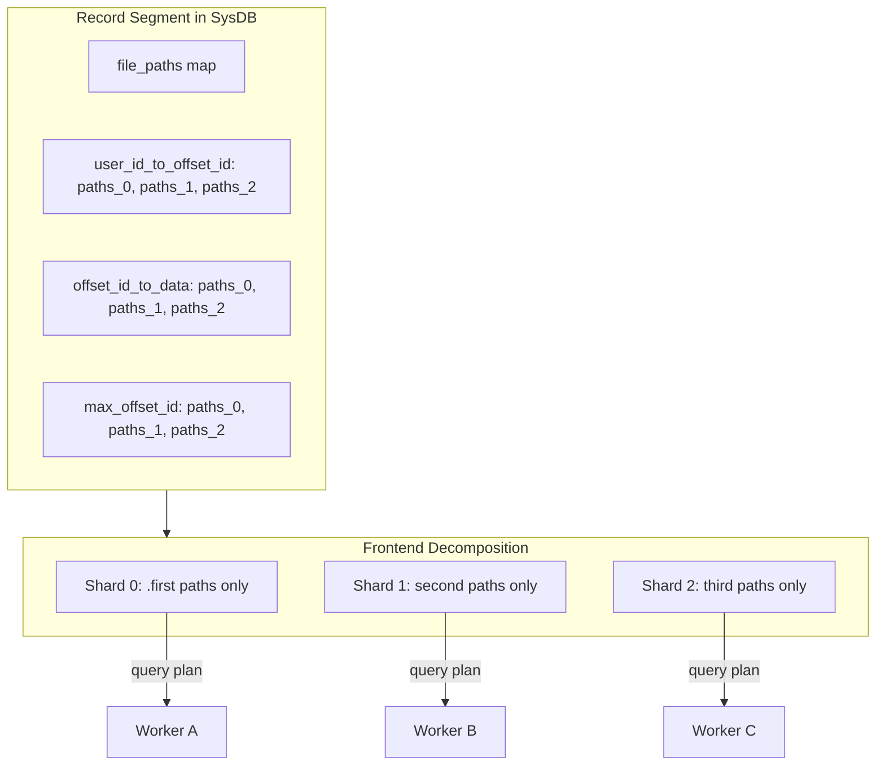
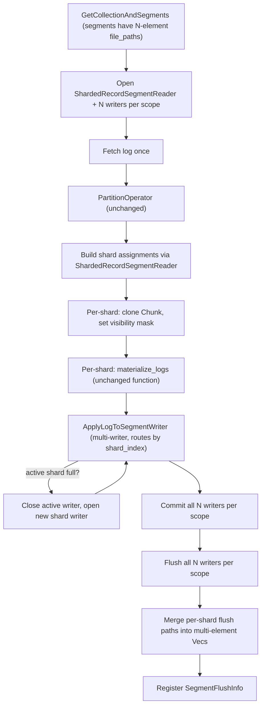
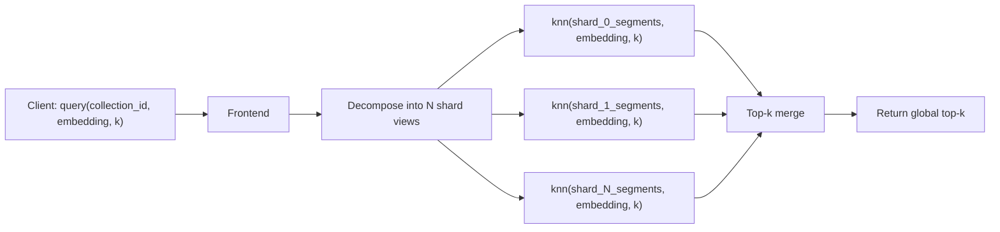

## Scope and Definition

We have a need to support collections up to 100B. 

1. We are actively working on making individual indices be able to contain more records. Today our vector and sparse index supports 50M records and we are working on pushing this further to the limits.
2. We will also have to shard our indices since (1) has its limits and it definitely won't take us to 100B.

For the purposes of this document, we will only talk about sharding compacted indices. Sharding uncompacted wal3 logs is out of scope.

## Segment level sharding

The existing `segment.file_paths: HashMap<String, Vec<String>>` was designed to hold multiple paths per index type within the segment. Today every reader/writer uses only the first path. **Sharding leverages the full Vec**: the ith element in each vec is the ith shard's path for that index. 

Collections start with 0 **shards** (identical to today -- empty file paths). When the active shard fills during compaction, a new entry is appended to this vec, growing the shard count. *Thus effectively, we are doing range-sharding on offset ids.*




Note that this design assumes different segment types can have different shard counts and go at their own individual pace. This is desirable because in future we can extend it to have different compaction speeds for different segments.

## Sharding in Wal3

We won't shard collections inside wal3 to cut scope and also because this is not yet a problem for V1. We could later extend the design to be able to do this but the scope of this document is sharding the compacted data.

## Write path changes

No changes

## DDL changes

The beauty of segment level sharding is that we don't need any DDL changes since the data model was already designed keeping this in mind (go chroma!)

## Compactor changes

### Modified compaction flow




### Open N readers and N writers ([log_fetch_orchestrator.rs](rust/worker/src/execution/orchestration/log_fetch_orchestrator.rs))

```
num_shards = record_segment.num_shards()   // derived from file_paths Vec length

// Create sharded reader (wraps Vec<RecordSegmentReader>)
sharded_record_reader = ShardedRecordSegmentReader::from_segment(record_segment)

for i in 0..num_shards:
    sliced_record = slice_segment_for_shard(record_segment, i)
    sliced_metadata = slice_segment_for_shard(metadata_segment, i)
    sliced_vector = slice_segment_for_shard(vector_segment, i)

    shard_record_writers[i] = RecordSegmentWriterShard::from_segment(sliced_record)   // unchanged writer
    shard_metadata_writers[i] = MetadataSegmentWriterShard::from_segment(sliced_metadata)
    shard_vector_writers[i] = VectorWriter::from_segment(sliced_vector)
    shard_offset_counters[i] = AtomicU32::new(sharded_record_reader.reader(i).max_offset_id + 1)
```

These are stored in `CompactWriters` which is extended to hold `Vec`s instead of single instances. The `ShardedRecordSegmentReader` wraps the per-shard readers. For unsharded collections (N=1), this is exactly one reader + one writer per scope -- identical to today.

### Slicing segments for per-shard readers and writers

Segment readers and writers are created from **sliced segments** -- the same `Segment` struct but with each `file_path` vec containing only the ith shard's path. 

```rust
fn slice_segment_for_shard(segment: &Segment, shard_index: usize) -> Segment {
    let mut sliced = segment.clone();
    for (_, paths) in sliced.file_path.iter_mut() {
        *paths = vec![paths[shard_index].clone()];
    }
    sliced
}
```

### Fetch log + Partition (unchanged)

`FetchLogOperator` and `PartitionOperator` work exactly as today. The log is fetched once, partitioned into partitions for parallelism. The partition operator groups ops on the same user_id into the same partition.

Note: The log partitions created as output of partitioning are not 1:1 with segment shards. This is on purpose otherwise there will likely be a high imbalance in the partitions. In the happy path, most log records are new and thus the latest shard will have most of the data to apply and others will be sparse.

### MaterializeLogOperator

The `MaterializeLogOperator` proceeds in two steps. First it assigns the correct shard number to log records. The output of this step is a `Vec<Chunk<LogRecord>>` where each chunk corresponds to a shard. The `Chunk<LogRecord>` already supports masking out entries which we leverage to show entries only belonging to a shard.

For each shard, we then call `materialize_logs` with the chunk of this shard and the record segment reader sliced for this shard.

**Algorithm:**

```
// Step A: Build shard assignment for each log entry using ShardedRecordSegmentReader.
// Uses total_len() to iterate ALL entries (including previously masked ones).
shard_assignments: Vec<usize> = vec![0; logs.total_len()]
for (log_record, index) in logs.iter():
    match sharded_reader.find_owning_shard(log_record.record.id):
        Some((shard_idx, _)) => shard_assignments[index] = shard_idx
        None => shard_assignments[index] = num_shards - 1   // new insert → active shard

// Step B: For each shard, clone the Chunk, set visibility mask, and materialize.
for shard_idx in 0..num_shards:
    let mut shard_logs = logs.clone()    // Arc clone of data, cheap
    let mask: Vec<bool> = (0..shard_logs.total_len())
        .map(|i| shard_assignments[i] == shard_idx)
        .collect()
    shard_logs.set_visibility(mask)

    // Call the UNCHANGED materialize_logs with this shard's filtered view
    per_shard_results[shard_idx] = materialize_logs(
        &Some(sharded_reader.reader(shard_idx)),
        shard_logs,
        Some(shard_offset_counters[shard_idx].clone()),
        &plan,
    )
```

`find_owning_shard()` traverses over shards from most recent to the least recent and uses bloom filter (each shard has a bloom filter) in the fast path and falls back to using the `user_id_to_offset_id` blockfile for existence check.

```rust
impl ShardedRecordSegmentReader {
    pub async fn find_owning_shard(
        &self,
        user_id: &str,
        plan: &RecordSegmentReaderOptions,
    ) -> Result<Option<(usize, u32)>, Box<dyn ChromaError>> {
        for i in (0..self.shard_readers.len()).rev() {
            let reader = &self.shard_readers[i];

            reader.load_bloom_filter(plan.use_bloom_filter).await;
            if let Some(Some(bf)) = reader.bloom_filter.get() {
                if !bf.contains(user_id) {
                    continue;
                }
            }

            match reader.get_offset_id_for_user_id(user_id, plan).await? {
                Some(offset_id) => return Ok(Some((i, offset_id))),
                None => continue,
            }
        }

        Ok(None)
    }
}
```

**Input changes:**

```rust
struct MaterializeLogInput {
    logs: Chunk<LogRecord>,
    sharded_reader: ShardedRecordSegmentReader,
    shard_offset_counters: Vec<Arc<AtomicU32>>,
    plan: RecordSegmentReaderOptions,
}
```

**Output changes:**

```rust
struct MaterializeLogOutput {
    per_shard_results: Vec<MaterializeLogsResult>,
    collection_logical_size_delta: i64,
}
```

### ApplyLogToSegmentWriter

```
// per_shard_results: Vec<MaterializeLogsResult> from the materialize step
for (shard_idx, result) in per_shard_results.iter().enumerate():
    for materialized_record in result.materialized:
        target = shard_idx

        // Inline shard split: only the active (last) shard can trigger this,
        // since it's the only one receiving new inserts.
        if target == active_shard AND record_writers[active_shard].count() > max_records_per_shard:
            record_writers.push(RecordSegmentWriterShard::new_empty(...))
            metadata_writers.push(MetadataSegmentWriterShard::new_empty(...))
            vector_writers.push(VectorWriter::new_empty(...))
            active_shard += 1
            target = active_shard

        writers[target].apply(materialized_record)
```

### Commit and Flush

```
// Commit all writers per scope
record_flushers = [writer.commit() for writer in record_writers]
metadata_flushers = [writer.commit() for writer in metadata_writers]
vector_flushers = [writer.commit() for writer in vector_writers]

// Flush all
record_paths = [flusher.flush() for flusher in record_flushers]
metadata_paths = [flusher.flush() for flusher in metadata_flushers]
vector_paths = [flusher.flush() for flusher in vector_flushers]
```

Each per-shard flush returns `HashMap<String, Vec<String>>` with single-element Vecs (the existing flush format). These are merged into multi-element Vecs:

```
// Merge for record segment:
merged_file_paths = HashMap::new()
for role_key in all_keys:
    merged_file_paths[role_key] = record_paths.iter()
        .map(|shard_paths| shard_paths[role_key][0].clone())
        .collect::<Vec<String>>()

// Same for metadata and vector segments
```

Build 3 `SegmentFlushInfo` entries (one per segment scope) with the merged multi-element `file_paths`.

### Register

Unchanged

## Read Path

In this design, I have made the FEs orchestrate multi-shard queries but this can also be performed by a designated query node by the FE. This decision is not irreversible and is easy to push down to query if needed but for V1 for code simplicity we do this.

### Frontend shard dispatch

The frontend sends the full `CollectionAndSegments` (with multi-element file_paths Vecs) to each query worker along with a `shard_index` and `num_shards`. The worker needs the full segment's file_paths so the active shard can access other shards' bloom filter paths for Upsert resolution during WAL materialization.

In [service_based_frontend.rs](rust/frontend/src/impls/service_based_frontend.rs):

```rust
let num_shards = cas.record_segment.num_shards();
for shard_index in 0..num_shards {
    let assignment_key = format!("{}:{}", collection_id, shard_index);
    // Send full CollectionAndSegments + shard_index + num_shards to the assigned worker
    executor.execute(cas.clone(), shard_index, num_shards, assignment_key);
}
```

The worker uses `slice_segment_for_shard(segment, shard_index)` to create single-shard readers for query execution (KNN, metadata filter, record lookup). Those sliced readers call `.first()` as always. For WAL materialization, the worker opens only its own shard's full `RecordSegmentReader` -- see "Worker WAL materialization" below.

### Routing in FE

Today, the `DistributedExecutor` routes all queries for a collection to the same set of nodes using rendezvous hashing on `collection_id` as the assignment key. With sharding, different shards of the same collection should land on different nodes to get horizontal scaling.

The frontend will now use `"{collection_id}:{shard_index}"` as the assignment key instead of just `collection_id`. For each `ShardView`, the frontend builds a per-shard query plan and calls the executor with the shard-specific key. For unsharded collections (1 shard), the key is `"{collection_id}:0"`, giving the same deterministic routing as today.

### Fan-out and merge

**Search scores ranking:**




Each shard runs the full search pipeline independently. The frontend merges by score and takes global top-k.

- **Distance-based rank expressions**: Scores are absolute, globally comparable. Top-k merge is exact.
- **Rank-based expressions (RRF)**: Per-shard ranks are local, not global. This is the same approximation Elasticsearch uses for distributed RRF. Acceptable for balanced shards. Exact RRF can be a future two-phase optimization.

**Handling limit/offset:**

limit/offset will need to be adjusted in this scatter/gather approach and can't just be pushed down as is. Counter-example:

```
Shard1: 2, 6, 10
Shard2: 4, 8, 12
Global order: 2, 4, 6, 8, 10, 12
offset=0, limit=2 → take 2 from shard1 and 4 from shard2
offset=2, limit=2 → take 6 from shard1 and 8 from shard2. But if push down offset=2, limit=2 as is this will be incorrect
```

Thus we pass down `offset=0` and `limit=original_offset+original_limit` to each shard. And we apply the original limit and offset after merging the results.

Total records processed at the frontend is `O(num_shards * (offset + limit))`. Deep offsets are expensive. A future optimization is cursor-based pagination which reduces per-shard work to `O(limit)` regardless of page depth.

**Search with group_by:**

Each shard runs the full search pipeline independently (KNN + rank + group_by). Today on a single shard, `RankedGroupBy` on the worker partitions results by metadata key(s), applies `MinK(k)` or `MaxK(k)` per group, flattens, re-sorts by score, then applies limit/offset.

With sharding, each shard only sees its local data, so per-group aggregation is local. The frontend must re-aggregate across shards:

1. Fan out search to all shards. Each shard runs the full pipeline with `offset=0`, `limit=original_offset + original_limit`, keeping per-group `MinK/MaxK` as specified.
2. At the frontend, collect all shard results and **re-group** by the same metadata key(s). The metadata values needed for re-grouping are available in each `SearchRecord`.
3. **Re-apply MinK/MaxK(k) per group** across the merged data -- pick the globally best k records per group by score.
4. Flatten and re-sort by score (same ordering as the worker's `RankedGroupBy`).
5. Apply global offset/limit.

**Correctness**: The global best-k per group is always a subset of the union of each shard's local best-k per group. No candidates are lost because each shard independently returns its best-k, and the global best-k is selected from that union.

**Get by ID:**

Fan out to all shards (can't deterministically route with sequential fill). Each shard returns results for IDs it contains. Union results. 

**Count:**

Fan out to all shards in parallel, sum.

**Delete / update by `where` clause:**

Today, the frontend resolves matching IDs first: it runs a `Get` with the `where` filter via the executor, then pushes per-ID `Operation::Delete` (or `Operation::Update`) records to the log.

With sharding, the `Get` step fans out to all shards (same as any other Get). The resulting delete/update records (by ID) flow into the single log. 

### Worker WAL materialization

When a query worker materializes the WAL for a sharded collection (`INDEX_AND_WAL` reads), it receives the **full collection WAL** and the **full segment** (with all shards' file_paths). The `ScanOperator` proto carries `shard_index` and `num_shards` (set by the frontend).

**Design goal:** Each worker opens only its own shard's full `RecordSegmentReader`. It does **not** open readers for other shards. This keeps per-worker resource cost O(1) regardless of shard count.

**Self-classification algorithm:** Each shard independently determines which WAL records belong to it using only its own reader. The active shard (last shard, the only one receiving new inserts) has a slightly different path for Upserts.

```
my_reader = RecordSegmentReader::from_segment(
    slice_segment_for_shard(record_segment, my_shard_index))
is_active_shard = (my_shard_index == num_shards - 1)

// Classify each WAL record using only my own reader.
let mask: Vec<bool> = vec![false; logs.total_len()]
for (log_record, index) in logs.iter():
    let exists_in_my_shard = my_reader.data_exists_for_user_id(
        log_record.record.id, &plan)

    mask[index] = match (log_record.record.operation, exists_in_my_shard, is_active_shard):
        // Record exists in my shard → I own it regardless of operation type
        (_, true, _) => true

        // Record not in my shard, I'm not active → not mine
        (_, false, false) => false

        // I'm the active shard, record not in my blockfile:
        (Add, false, true) => true          // new insert → mine
        (Delete, false, true) => false      // must exist elsewhere → not mine
        (Update, false, true) => false      // must exist elsewhere → not mine
        (Upsert, false, true) =>
            // Ambiguous: could be new (mine) or existing in an older shard.
            // Resolve using other shards' bloom filters (see below).
            !exists_in_any_other_shard(log_record.record.id)

let mut shard_logs = logs.clone()
shard_logs.set_visibility(mask)

let result = materialize_logs(
    &Some(my_reader),
    shard_logs,
    None,   // no offset counter needed for queries
    &plan,
)
```

**Resolving Upsert ambiguity on the active shard:**

The active shard is the only shard that needs cross-shard information, and only for Upserts where the record is not found locally. For this case, the active shard loads **only the bloom filters** (not full readers) of the other shards. Bloom filters are small (O(KB-MB) each) and are cached by the `BloomFilterManager`.

```rust
/// Called only by the active shard, only for Upsert-not-found-locally.
/// Loads bloom filters for other shards from segment file_paths.
/// Returns true if the user_id likely exists in another shard.
fn exists_in_any_other_shard(
    &self,
    user_id: &str,
    record_segment: &Segment,
    bloom_filter_manager: &BloomFilterManager,
) -> bool {
    let bloom_paths = record_segment.file_path
        .get(USER_ID_BLOOM_FILTER)
        .unwrap_or(&vec![]);

    // Check other shards newest-first (temporal locality)
    for i in (0..bloom_paths.len()).rev() {
        if i == self.my_shard_index { continue; }

        let bf = bloom_filter_manager.get(&bloom_paths[i], true).await;
        match bf {
            Ok(bloom) => {
                if !bloom.contains(user_id) {
                    continue;  // definitely not in this shard
                }
                // Bloom says "maybe" → open just the user_id_to_offset_id
                // blockfile for this shard to confirm (not a full 4-file reader).
                let confirmed = check_user_id_blockfile(
                    record_segment, i, user_id).await;
                if confirmed { return true; }
                // False positive → continue checking other shards
            }
            Err(_) => {
                // Bloom not available → fall back to blockfile check
                let confirmed = check_user_id_blockfile(
                    record_segment, i, user_id).await;
                if confirmed { return true; }
            }
        }
    }
    false  // not found in any other shard → genuinely new
}
```

**Cost summary:**


| Worker role                      | Full readers opened | Bloom filters loaded | Blockfile fallbacks           |
| -------------------------------- | ------------------- | -------------------- | ----------------------------- |
| Non-active shard                 | 1 (own shard)       | 0                    | 0                             |
| Active shard (no Upserts in WAL) | 1 (own shard)       | 0                    | 0                             |
| Active shard (with Upserts)      | 1 (own shard)       | up to N-1 (cached)   | Only on bloom false positives |


For the common case (mostly Adds, few Upserts), even the active shard opens only 1 reader.

`materialize_logs` itself is unchanged. When `shard_index` is absent (unsharded collection), no filtering is applied -- identical to current behavior.

### SysDB schema changes

No schema changes needed

### Go model changes

No Go model changes needed

### Sharding config

We have two options here:

1. We have a configurable max_size per shard and create shards on demand whenever the current shard becomes full
2. We have a configurable num_shards that fixes the fan out and we merge/split shards in the background.

### Shard size

- 25M?

### Shard count

- 10?

