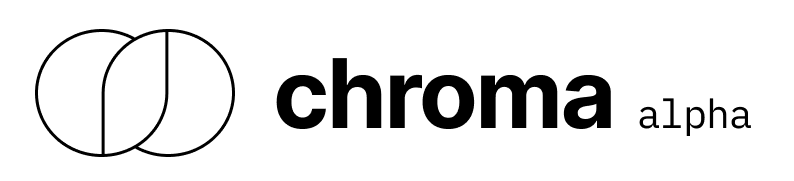

 

**_Chroma is currently in alpha_**

Chroma is an open-source python package that can do things like:
- Deduplicate labels
- Find bad labels / unusual training examples
- Find interesting production examples
- Detect training / prod data drift

Chroma is under active development to become the analytical engine for your production ML pipeline.

[View an example using MNIST](./examples/mnist_embeddings/README.md)

### Try it out

Chroma requires Python 3.9 and redis installed. 

```
python3 -m venv chroma_env
source chroma_env/bin/activate
brew install redis
pip install -e .
make preload-data
make run
```

### License
Chroma is licensed under Apache 2.0.

