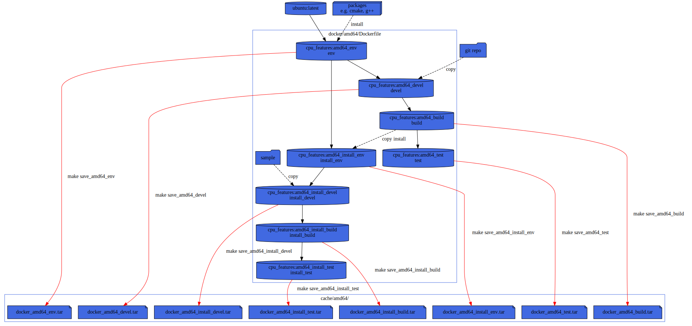

## Makefile/Docker testing
To test the build on various distro, we are using docker containers and a Makefile for orchestration.

pros:
* You are independent of third party CI runner config
  (e.g. [github action virtual-environnments](https://github.com/actions/virtual-environments)).
* You can run it locally on your linux system.
* Most CI provide runners with docker and Makefile installed.

cons:
* Only GNU/Linux distro supported.

### Usage
To get the help simply type:
```sh
make
```

note: you can also use from top directory
```sh
make --directory=cmake/ci
```

### Example
For example to test mips32 inside an container:
```sh
make mips32_test
```

### Docker layers
Dockerfile is splitted in several stages.




## Makefile/Vagrant testing
To test build for FreeBSD we are using Vagrant and VirtualBox box.

This is similar to the docker stuff but use `vagrant` as `docker` cli and
VirtuaBox to replace the docker engine daemon.
