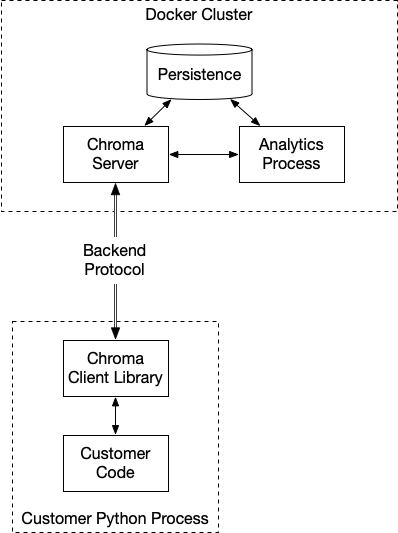

# Chroma MVP Application Architecture

## Context

Chroma is a prototype application for analyzing the embeddings of a ML model.

As an early stage product, it is essential to build an effective MVP
to put in front of users and start iterating.

However, we also want to make good design choices, so as the system
grows and pivots we can built upon a stable foundation and avoid
costly rewrites and API churn as much as practical.

### Functional Requirements

- A python package for extracting embeddings and sending them to the Chroma API.
- An application running in the background which receives embeddings and stores them.
- Embeddings should be properly catalouged with good metadata about:
  - associated data set and model
  - context of embedding (training/triage)
  - embedding inputs/outputs
- An algorithm for computing retraining priority.
- An algorithm for similarity search between input datapoints.
- An API for retrieving inputs with their priorities.
- An API for receiving a retraining trigger.

### Short-term Requirements

- New users should have a path to experimenting with the product in < 5 minutes.
  - Could either be a "1 click install" on a single machine or a SaaS offering.
- Deployment in "production mode" should support a client/server architecture.
  - Server to store embeddings and perform server-side calculations
  - Client python API running on local developer environments or as part of ML pipeline
- Cloud deployment of production mode should be easy.
- Deployable on bare metal or virtualized infrastructure
- Efficient batch loadings of ~millions of embeddings.
- Efficient storage of 10-100 ~million embeddings.
- Efficient batch query & retrieval via APIs.

### Long-term Requirements

- "Online" processing mode
  - Data streamed to server at high volumes
  - Low-latency filtering
- Clustered architecture to support arbitrarily higher data volumes

## Decision

We will implement and distribute the Chroma Client as a Python library.

We will implement and distribute the Chroma Server as a collection of Docker images.

The entry point for installing/running Chroma Server will be a minimal
wrapper script around Docker Compose. The process for running Chroma
Server will be to clone the git repository, then run the startup
script.

The Chroma Client is Chroma's only stable, public API. As the
customer-facing part of the product, The Chroma Client is optimized
for user experience, structured to showcase the value of Chroma, and
returns data in the format most immediately useful to consumers:
Python objects and Numpy data frames.

The communication channel between the Chroma Server and Chroma Client
is a "private API" that should not be used directly from
elsewhere. Since it needs to send large amounts of data back and forth
to the Chroma Client, it is the primary performance bottleneck. Chroma
reserves the right to alter the protocol between versions of Chroma or
implement nonstandard, hybrid or bespoke formats for performance
reasons. The priority for the design of the backend protocol
is throughput and latency, not ease of consumption.

This also allows the backend protocol to be "polymorphic" where
possible for the best performance. For example, it could detect if it
was running on the same hardware as the client, and if so, implement
zero-copy memory sharing instead of seralizing data over a network.

## Consequences

- We can start by implementing this architecture in a very simple way
  using the existing Chroma PoC: SQLite, FastAPI, etc.
- There will be a strong abstraction layer between the Chroma Client
  and the backend. This will allow continued and constant evolution of
  the backend without disruption to public APIs.
- Install will be simplified and reliable in that the user will not
  need to manage any dependencies or requirements except Docker
  itself.
- Using Docker from the start will smooth the eventual transition to
  clustered and distributed architectures (e.g, Kubernetes, ECS)
- In order to support languages other than Python, Chroma will need to
  provide libraries in those languages capable of connecting to the
  backend protocol.
