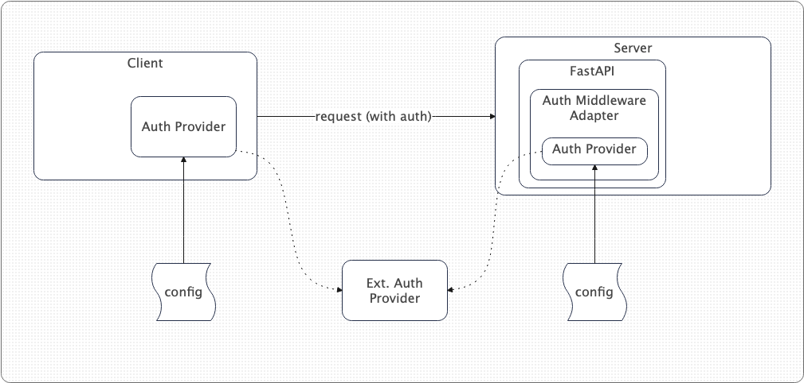
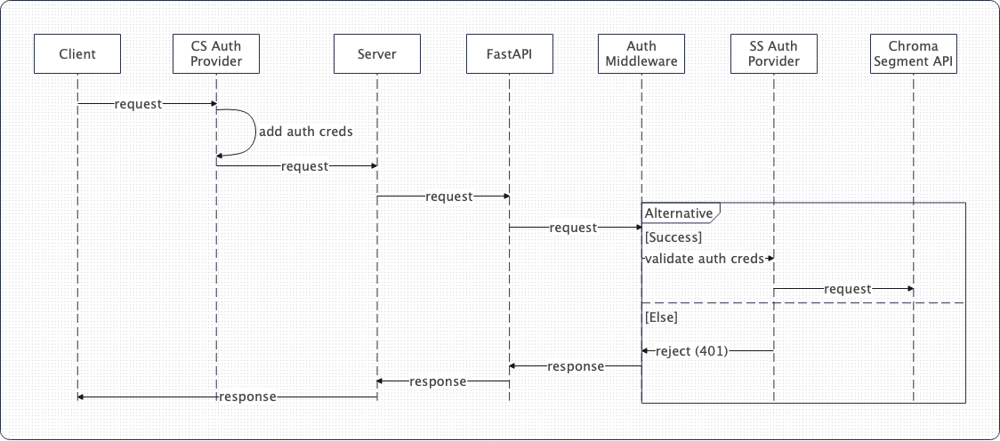

# CIP-2: Auth Providers Proposal

## Status

Current Status: `Under Discussion`

## **Motivation**

Currently, Chroma does not provide any authentication mechanism. This CIP proposes to
to add authentication abstractions and basic authentication mechanisms to Chroma.

There are intrinsic and extrinsic motivations for this CIP. The intrinsic motivation
is to provide a secure way to access Chroma as adoption grows and the team is gearing up to release a cloud offering.
The extrinsic motivation is driven by the community which is deploying Chroma in both public and private clouds and
in test and production environments. The community has expressed the need for authentication and authorization.

> Observation: We consider the Auth to be applicable to client-server mode.

## **Public Interfaces**

Changes to the public interface are related to the `Settings` class where we introduce new optional attributes to control server and client-side auth providers.

## **Proposed Changes**

We propose two abstractions, one for the server-side and another for the [client-side.](http://client-side.In) In addition we also introduce a FastAPI/startlette middleware adapter which will allow using the server-side abstractions in the context of FastAPI.

Architecture Overview:

Request Sequence:

Reasoning:

- Server-side abstraction - it is very useful as the intention is to support a variety of auth providers.
- Client-side abstraction - similar reasoning but from client's perspective. It will allow for both standard and non-standard auth provider plugins to be added without further impacting the client side
- Backend (fastAPI) adapter - this is a backend-specific way of loading server-side auth provider plugins. It will also serve as a template/blueprint when it comes to introducing the auth plugins to another backend framework (e.g. Flask)

We also propose that each auth provider on either side must be configurable via three main methods depending on developer preference:

- File-base - a configuration file that provides the requisite config and credentials (recommended for production)
- Env - configuration through environment variables (this can also apply for the file-based config, which can be specified in env var)
- Programmatically - provide requisite configuration through CLI or directly in code (it is left for the developer to decide how such configuration is loaded and made available to the auth provider) - this is possibly the least secure and should be used for testing

The intention is to start with two minimal but useful Auth providers:

- Basic Auth - base64 encoded user and password credentials. The credentials will be static in nature and defined via auth provider config
- Token - A simple static token implementation

Both of the above providers will rely on the `Authorization` header to achieve their functionality.

> Both initial providers are there to help introduce a bear minimum security but are not recommended for production use

Further work:

- Introduction of JWT and mTLS auth providers
- API Keys
- Chroma managed user store - this would be similar to what standard DBMS’ are doing today - maintain a table with users and salted password hashes
- K8s RBAC integration (for cloud-native deployments)
- GCP service accounts?
- SPIFFE and SPIRE integrations
- Go and Java client-side auth providers (for other impl like Rust and Ruby, we need to discuss with respective maintainers)

> Note: this CIP intentionally does not tackle authZ but acknowledges that authN and authZ must work in tandem in future releases

## **Compatibility, Deprecation, and Migration Plan**

This change, introducing a pluggable auth framework is no impacting compatibility of existing deployments and users can upgrade and use the new framework without the need for migration.

No deprecations.

## **Test Plan**

We will introduce a new set of tests to verify both client and server-side auth providers.

## **Rejected Alternatives**

We have considered direct middleware Auth or existing third-party libraries for FastAPI integration with auth providers, but that will create a dependency for Chroma on FastAPI itself.

We have also considered using OAuth 2.0 or OIDC however the challenge there is that both of these protocols are generally intended for User (human) auth whereas in our case we have a system-to-system auth. That said there still might be room for either of these protocols, but further more in-depth use case analysis is required.

Relying entirely on external providers, while this is possible not providing out-of-the-box integrated auth capabilities is a non-starter for many enterprise customers.
