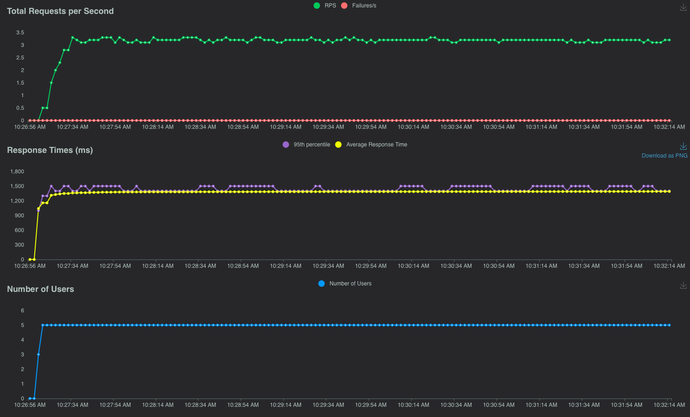
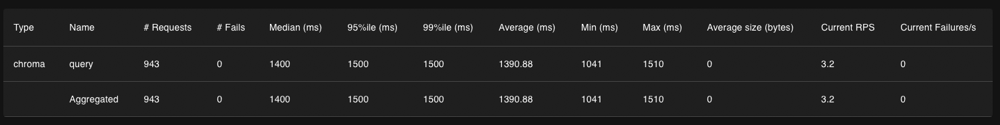
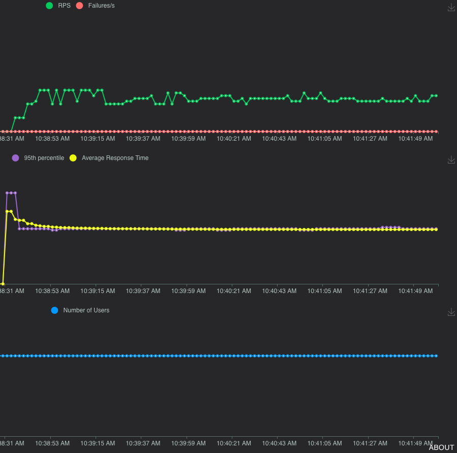
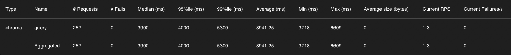
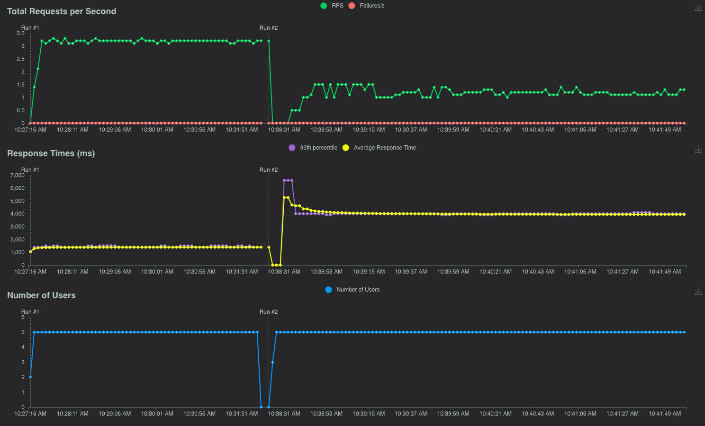

# CIP-02152024: Maintenance Tasks

## Status

Current Status: `Under Discussion`

## Motivation

Through extensive experimentation we have determined the following to be true:

1. Using frequent `ANALYZE` and `VACUUM` commands on Chroma's sqlite database affirmatively improves the performance of
   the whole system.
2. Periodic WAL cleanup both improves the performance and reduces the storage requirements of the database drastically.
3. Query optimization of complex metadata filtering queries improves performance by a factor of N (where N is the
   average number of metadata fields per record in the database).

We see a significant benefit for Chroma users if we can automate these tasks. This CIP proposes to automation of tasks 1
and 2, while we suggest that task 3 is a separate CIP.

Community issues associated with slow performance:

- https://github.com/chroma-core/chroma/issues/1043
- https://github.com/chroma-core/chroma/issues/1394
- https://github.com/chroma-core/chroma/issues/1755
- https://discord.com/channels/1073293645303795742/1210414333717254144
- https://discord.com/channels/1073293645303795742/1202226062587875438
- https://discord.com/channels/1073293645303795742/1168605029532434444

## Public Interfaces

Upon further examination of possible approaches, we do not suggest any changes to the public interface, other than
the following configuration options:

- `maintenance_clean_wal_at_startup` - a boolean flag that defaults to `False`
- `maintenance_clean_wal_every_x_updates` - an integer indicating the number of WAL updates to trigger clean up.
  Defaults to `10` (optional)
- `maintenance_clean_wal_every_x_seconds` - an integer indicating the number of seconds to trigger clean up. Defaults
  to `3600` (optional)
- `maintenance_vacuum_at_startup` - a boolean flag that defaults to `False`
- `maintenance_vacuum_every_x_seconds` - an integer indicating the number of seconds to trigger vacuum. Defaults
  to `3600`

## Proposed Changes

The proposed changes impact the persistent client and the server backend.

The `PersistentClient` will support the suggested configuration option, allowing it to perform maintenance tasks on
Chroma.

The server backend will rely on the changes introduced in the `PersistentClient` to perform maintenance tasks on the
database.

### Operations

We propose the following optimization actions:

- WAL Cleanup - the change is introduced in `EmbeddingQueue`. The task executed upon component startup or upon
  `submit_embeddings` calls
- Run `VAUCUM` - Changes introduced at SysDB level. The task is executed upon SysDB startup or triggered by
  SegmentAPI's `_add()`, `_upsert()`, `_update()`, or `_delete()` method calls.
- Run `ANALYZE` - Changes introduced at SysDB level. The task is executed upon SysDB startup or triggered by
  SegmentAPI's `_add()`, `_upsert()`, `_update()`, or `_delete()` method calls.

#### WAL Cleanup

Cleaning up the WAL is a great way to reduce the storage requirements of Chroma and should be performed
periodically, even without the user intervention. E.g. calling a maintenance task. A good DB should not have to force
users into keeping track and maintaining it.

For the aforementioned reason, we propose that WAL clean-up is implemented and performed implicitly via configuration.
We propose the following two options:

- At startup
- Reactive - whenever the user is using the database.

> Note: The above options are not mutually exclusive.

The `At startup` options is great for when users are upgrading e.g. from previous to the release introducing the WAL
clean up. This will help users reign in their storage the moment they upgrade. This is great, but we should acknowledge
that WAL clean-ups, depending on the size of the WAL can be time-consuming, therefore we suggest that a warning message
is displayed to the user to indicate that the WAL will be cleaned up, and they should expect a delay in the startup. We
further propose that this option is configured via a new configuration option `clean_wal_at_startup` (or similar) which
defaults to `False`.

The `Reactive` option is great for ongoing maintenance for Chroma instances that are long-running. We propose that any
update operation (e.g. `add()`, `update()`, `delete()`) will trigger a WAL clean-up, as a background task (
see [FastAPI docs](https://fastapi.tiangolo.com/reference/background/)), that will not impact the user experience. We
propose several heuristics to trigger the WAL clean-up:

- Every `n` operations - where `n` is a configuration option that defaults to `10` (or something more sensible, based on
  posthog stats)
- Every `m` seconds - where `m` is a configuration option that defaults to `3600`

> Note: Possibly better approach is to use scheduled maintenance where the cleanup is executed on a predefined
> schedule (e.g. low-traffic hours). However, such scheduling requires a scheduler which is not available in Chroma at
> the moment.

Important factor about the WAL is that it is an excellent way to recover from a crash, corruption of the binary indices,
or accidental deletes. Therefore, we suggest that requisite measures are put in place to ensure that users have the
ability to back up their WAL prior to clean-up. We feel strongly about not, destroying a perfectly good source of
recovery, so we propose that the WAL backup feature is part of this CIP.

To keep things simple we suggest that WAL backups are snapshots of the WAL at a given point in time. We propose that the
user specifies the location where backups are stored. Each backup is a dump of the WAL as a separate sqlite3 file, but
archived and timestamped.

#### VACUUM

`VACUUM` is a blocking operation from sqlite3 perspective, and we suggest that our approach to it is similar to the WAL
clean-up where, we carry out the operation outside of normal DB transactions or even the API.

Similarly to the WAL clean-up, we propose that the VACUUM operation is performed implicitly via configuration and does
not require active involvement from the user. We propose that VACUUM operation is carried at:

- `Startup`
- `Reactive` - whenever the user is actively using the database, and upon reaching a certain threshold of free pages in
  the sqlite3 file.

During startup, we propose that analogous to the WAL clean-up, a warning message is displayed to the user to indicate
that the VACUUM will be performed, and they should expect a delay in the startup. We further propose that this option is
configured via a new configuration option `vacuum_at_startup` (or similar) which defaults to `False`.

The `Reactive`, will ticker as the `VACUUM` locks the sqlite3 db until it is complete. For highly-fragmented sqlite3
this operation can take a long time, thus completely locking up Chroma.

### Dry Run

> Note: This section is obsolete with running tasks at startup or reactively.

By default, optimize will execute in a dry-run mode, just providing the user with feedback on what it would do (
intuition: Query Planner EXPLAIN). The user can then decide to run the operation with the `dry_run` flag set to `False`.

These are the steps performed by each action in dry-run mode:

- Clean WAL - The operation will provide the user with an estimate how many entries will be purged from the WAL, per
  collection summary of WAL purged. A heuristic will be implemented to provide the user with an estimate of how much
  space will be cleaned up (after VACUUM is also executed)
- VACUUM - The operation will provide the user with an estimate of how much space will be cleaned up. SQLite does not
  provide direct info about used storage, therefore we'll rely on page-related heuristics to provide the user with an
  estimate of how much space will be cleaned up (after VACUUM is also executed)
- ANALYZE - The operation will not provide feedback as SQLIte does not provide utilities to estimate the impacts
  of `ANALYZE`. This operation will not provide feedback on the dry-run mode.

### Telemetry

All maintenance tasks suggested above shall have telemetry events associated with them. Given the long-running nature of
the tasks we suggest that two events are emitted for each task - a start event and a completion event. The start event
will contain the configuration options used for the task, and the completion event will contain the stats of the
operation.

### Data Structures

> Note: This section is obsolete with running tasks at startup or reactively.

We propose that the operation takes in the following request object:

```python
class OptimizationRequest(TypedDict):
    dry_run: bool  # defaults to True
    vacuum: bool  # defaults to True
    analyze: bool  # defaults to True
    wal_cleanup: bool  # defaults to True
```

We propose that the `optimize()` operation return a bare minimum stats on what it has achieved. Our initial suggestion
is the following:

```python
class OptimizationStats(TypedDict):
    storage_reduction: float
    wal_entries_purged: int
```

We think that providing meaningful stats is important for users to understand the impact of the optimization.

### Experimentation

This is how the DB looks like after importing 1M records with 2 metadata fields each:

```bash
(venv) % ls -lhatr optimize-test
total 23659040
drwxr-xr-x  54 user  staff   1.7K Feb 15 18:29 ..
drwxr-xr-x@  7 user  staff   224B Feb 15 18:29 6cdc4d45-3977-46ef-8c4b-123c303e0519
-rw-r--r--@  1 user  staff    11G Feb 15 19:07 chroma.sqlite3
drwxr-xr-x@  4 user  staff   128B Feb 15 19:07 .
(venv) % du -h optimize-test/
5.9G    optimize-test/6cdc4d45-3977-46ef-8c4b-123c303e0519
17G    optimize-test/
```

To benchmark a heavy filtering query:

```bash
(venv) sqlite3 optimize-test-noopt/chroma.sqlite3 < query1.sql | tail -1
Run Time: real 10.713 user 6.983000 sys 3.542708
```

Here is how the SQL query looks like for `get()` with `where={"$or":[{"rand":{"$gt": 501}},{"rand":{"$gt": 704}}]}`:

```sql
.timer on
SELECT "embeddings"."id",
       "embeddings"."embedding_id",
       "embeddings"."seq_id",
       "embedding_metadata"."key",
       "embedding_metadata"."string_value",
       "embedding_metadata"."int_value",
       "embedding_metadata"."float_value",
       "embedding_metadata"."bool_value"
FROM "embedding_metadata"
         JOIN "embeddings" ON "embeddings"."id" = "embedding_metadata"."id"
WHERE "embeddings"."segment_id" = '04f48070-bbd4-41ea-9928-77309c20965e'
  AND ("embedding_metadata"."id" IN (SELECT "id"
                                     FROM "embedding_metadata"
                                     WHERE "key" = 'rand'
                                       AND ("int_value" > 501 OR "float_value" > 501)) OR
       "embedding_metadata"."id" IN (SELECT "id"
                                     FROM "embedding_metadata"
                                     WHERE "key" = 'rand'
                                       AND ("int_value" < 704 OR "float_value" < 704)))
ORDER BY "embeddings"."embedding_id";
```

We also examine the WAL:

```bash
(venv) % sqlite3 optimize-test/chroma.sqlite3 'select count(*) from embeddings_queue;'
1000000
```

Now let's run the optimization:

```python
import chromadb

client = chromadb.PersistentClient("optimize-test")
client.optimize()
```

We have the following results:

```bash
(venv) % ls -lhatr optimize-test
total 4051464
drwxr-xr-x@  7 user  staff   224B Feb 15 18:29 6cdc4d45-3977-46ef-8c4b-123c303e0519
drwxr-xr-x@  4 user  staff   128B Feb 15 19:14 .
-rw-r--r--@  1 user  staff   1.9G Feb 15 19:14 chroma.sqlite3
drwxr-xr-x  54 user  staff   1.7K Feb 15 19:14 ..
(venv) % du -h optimize-test/
5.9G    optimize-test/6cdc4d45-3977-46ef-8c4b-123c303e0519
7.9G    optimize-test/
(venv) % sqlite3 optimize-test/chroma.sqlite3 'select count(*) from embeddings_queue;'
1
(venv) sqlite3 optimize-test/chroma.sqlite3 < query1.sql | tail -1
Run Time: real 12.374 user 5.573911 sys 1.288665
```

The optimize command has achieved the following:

- Reduced the size of the database by about 9GB (by cleaning up the WAL from 1M documents with 1536 dim embeddings)
- Optimized Query planning and execution which is visible by the lower user and sys times in the query execution.

> Note: It is worth pointing out that the overall query time has increased, but that is inconsequential as we'll
> demonstrate in the query benchmarking section.

#### Side Note about WAL Cleanup

The underlying SQL schema does not have a auto-increment on the WAL table (`embeddings_queue`) key (`seq_id`) therefore
we cannot a complete cleanup of the WAL is not possible. The reason for that is once we remove all entries (e.g. when
the number of WAL entries aligns with the sync threshold of the vector index), subsequent insertions will begin from the
lowest key which will be 1. The result of the latter is that none of the newly inserted entries make it to either the
Metadata or the Vector indices as their max_seq_id will be higher than the newly inserted entries.

We intend to fix that by introducing an auto-increment on the `seq_id` key in the WAL table in a separate PR.

### Query Benchmarking

We'll use Locust to benchmark the actual implications of optimizing your databases.

We will benchmark the above wost-case query with range filter, which historically tends to be the slowest query.

In our locust setup we will `get()` from the database for a random vector which we will use to query with the range
filter.

Our locust test will run for 5m to ensure any jitter in the results is minimized.

**Optimized database:**





**Non-optimized database:**





**Side-by-Side Comparison:**



Our observations are that the proposed optimization has a drastic impact on the performance of Chroma. It is important
to note that for this benchmark we are using a single workload with get/query semantics and more investigations are
needed to understand the impact on other workloads (e.g. add/update/delete).

> Note: All tests were run on an 2023 M3 Max. Results on other systems may vary, but should follow the same trend.

## Compatibility, Deprecation, and Migration Plan

The change is backward compatible. Newer clients will not work with older APIs, but older clients will work with the new
Chroma version.

## Test Plan

- API tests

## Rejected Alternatives

TBD.
