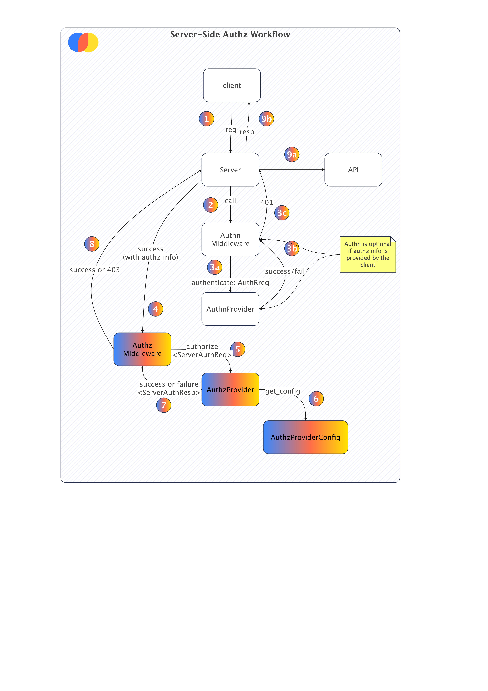

# CIP-10112023: Authorization

## Status

Current Status: `Under Discussion`

## **Motivation**

The motivation for introducing an authorization feature in Chroma is to address the lack of a proper authorization model that many users are struggling with, especially those who deploy production apps. Additionally, as Chroma is gearing up for production-grade deployments out of the box, it is essential to have a proper authorization model in place for distributed and hosted Chroma instances.

## **Public Interfaces**

No changes to public interfaces are proposed in this CIP.

## **Proposed Changes**

In this CIP we propose the introduction of abstractions necessary for implementing a multi-user authorization scheme in a pluggable way. We also propose a baseline implementation of such a scheme which will be shipped with Chroma as a default authorization provider.

It is important to keep in mind that the client/server interaction in Chroma is meant to be stateless, as such the Authorization approach must also follow the same principle. This means that the server must not store any state about the user's authorization. The authorization decision must be made on a per-request basis.

The diagram below illustrates the levels of abstractions we introduce:



- (1) Client Sends Request to Chroma Server
- (2) Authentication Middleware intercepts the request
- (3a) Authentication Provider attempts to authenticate the user
- (3b) Authentication Provider returns success (with user identity) or failure
- (3c) Authentication Middleware returns success or failure to server
- (4) Server passes the request with user identity to the Authorization Middleware
- (5) Authorization Middleware creates Authorization Request Context
- (6) Authorization Context Decorator (at API endpoint) intercepts the call and using Authorization Request Context creates an Authorization Context that is then passed to the Authorization Provider
- (7)Authorization Context Decorator raises and error if the Authorization Provider returns a failure or passes the request to the API endpoint if the Authorization Provider returns success
- (8a) Request is passed to the API endpoint for execution
- (8b) Response is returned to the client

In the above diagram we highlight the new abstractions we introduce in this CIP and we also demonstrate the interop with the existing Authentication

### Concepts

#### Basic Authorization Terms

##### User

A user is an entity that can perform actions on resources. A user can be a human or a machine.

##### Resource

A resource is an entity that can be acted upon. A resource can be a database, a collection, a document.

> Note: In this release we do not support document as a resource.

##### Action

An action is an operation that can be performed on a resource. An action can be `read`, `write`, `delete`, `update`, `create`, `list`, `count`, `query`, `peek`, `get`, `add`, `upsert`, `get_or_create`. Actions are resource specific.

##### Role

A role is a collection of actions that a user can perform on a resource. This pertains to RBAC or Role Based Access Control.

#### Chroma Authorization Terms

##### ServerAuthorizationProvider

The `ServerAuthorizationProvider` is a class that abstracts a provider that will authorize requests to the Chroma server (FastAPI). In practical terms the provider will integrate with an external authorization service (e.g. Auth0, Okta, Permit.io etc.) and will be responsible for allowing or denying the user request.

In our baseline implementation we will provide a simple file-based RBAC authorization provider that will read authorization configuration from a YAML file.

##### ServerAuthzConfigurationProvider

The `ServerAuthzConfigurationProvider` is a class that abstracts a the configuration needed for authorization provider to work. In practice that implies, reading secrets from environment variables, reading configuration from a file, or reading configuration from a database or secrets file, or even KMS.

In our baseline implementation the AuthzConfigurationProvider will read configuration from a YAML file that contains the authorization configuration.

##### ServerAuthorizationRequest

The `ServerAuthorizationRequest` encapsulates the authorization context.

##### ServerAuthorizationResponse

Authorization response provides authorization provider evaluation response. It returns a boolean response indicating whether the request is allowed or denied.

##### ChromaAuthzMiddleware

The `ChromaAuthzMiddleware` is an abstraction for the server-side middleware. At the time of writing we only support FastAPI. The  middleware interface supports several methods:

- `authorize` - authorizes the request against the authorization provider.
- `ignore_operation` - determines whether or not the operation should be ignored by the middleware
- `instrument_server` - an optional method for additional server instrumentation. For example, header injection.

##### AuthorizationError

Error thrown when an authorization request is disallowed/denied by the authorization provider. Depending on authorization provider's implementation such error may also be thrown when the authorization provider is not available or an internal error ocurred.

Client semantics of this error is a 403 Unauthorized error being returned over HTTP interface.

##### AuthorizationContext

The AuthorizationContext is composed of three components as defined in #Basic Authorization Terms:

- User
- Resource
- Action


```json
{
"user": {"id": "API Token or User Id"},
"resource": {"namespace": "*", "id": "collection_id","type": "database"},
"action": {"id":"get_or_create"},
}
```

We intentionally want to keep this as minimal as possible to avoid any unnecessary complexity and to allow users to easily understand the authorization model. However the context is just an abstraction of the above representation and each authorization provider will need to implement the above and if necessary extend it to support additional information.

We propose the following classes to represent the above:

```python
@dataclass
class AuthzUser:
    id: Optional[str]
    attributes: Optional[Dict[str, Any]] = None
    claims: Optional[Dict[str, Any]] = None


@dataclass
class AuthzResource:
    id: Optional[str]
    type: Optional[str]
    namespace: Optional[str]
    attributes: Optional[Dict[str, Any]] = None


@dataclass
class AuthzAction:
    id: str
    attributes: Optional[Dict[str, Any]] = None


@dataclass
class AuthorizationContext:
    user: AuthzUser
    resource: AuthzResource
    action: AuthzAction

```

##### User Identity

In this CIP we also introduce a handover or bridge mechanism from authentication to authorization which we term `User Identity`. The object is meant to encapsulate the user identity and possibly also claims, roles and attributes in the future.

```python
class UserIdentity(EnforceOverrides, ABC):
    @abstractmethod
    def get_user_id(self) -> str:
        ...
```

### Baseline Implementation

In this section we propose a minimal implementation example of the authorization framework which will also ship in Chroma as a default authorization provider and a reference implementation. Our reference implementation relies on static configuration files in YAML format.

We introduce the following implementations:

- `LocalUserConfigAuthorizationConfigurationProvider` - a simple authz configuration to read the yaml configuration file.
- `SimpleRBACAuthorizationProvider` - a simple RBAC authorization provider that reads the configuration from the configuration provider, creates a list of tuples for every user and his role action mappings (e.g. `('user@example.com','tenant_x', 'db', 'list_collections')`) and evaluates the authorization request against the list of tuples.

#### Authentication and Authorization Config Scheme

In our baseline implementation we propose the following configuration scheme:

```yaml
resource_type_action: # This is here just for reference
  - tenant:create_tenant
  - tenant:get_tenant
  - db:create_database
  - db:get_database
  - db:reset
  - db:list_collections
  - collection:get_collection
  - db:create_collection
  - db:get_or_create_collection
  - collection:delete_collection
  - collection:update_collection
  - collection:add
  - collection:delete
  - collection:get
  - collection:query
  - collection:peek #from API perspective this is the same as collection:get
  - collection:count
  - collection:update
  - collection:upsert

roles_mapping:
  admin:
    actions:
      [
        "tenant:create_tenant",
        "tenant:get_tenant",
        "db:create_database",
        "db:get_database",
        "db:reset",
        "db:list_collections",
        "collection:get_collection",
        "db:create_collection",
        "db:get_or_create_collection",
        "collection:delete_collection",
        "collection:update_collection",
        "collection:add",
        "collection:delete",
        "collection:get",
        "collection:query",
        "collection:peek",
        "collection:update",
        "collection:upsert",
        "collection:count",
      ]
  write:
    actions:
      [
        "tenant:get_tenant",
        "db:get_database",
        "db:list_collections",
        "collection:get_collection",
        "db:create_collection",
        "db:get_or_create_collection",
        "collection:delete_collection",
        "collection:update_collection",
        "collection:add",
        "collection:delete",
        "collection:get",
        "collection:query",
        "collection:peek",
        "collection:update",
        "collection:upsert",
        "collection:count",
      ]
  db_read:
    actions:
      [
        "tenant:get_tenant",
        "db:get_database",
        "db:list_collections",
        "collection:get_collection",
        "db:create_collection",
        "db:get_or_create_collection",
        "collection:delete_collection",
        "collection:update_collection",
      ]
  collection_read:
    actions:
      [
        "tenant:get_tenant",
        "db:get_database",
        "db:list_collections",
        "collection:get_collection",
        "collection:get",
        "collection:query",
        "collection:peek",
        "collection:count",
      ]
  collection_x_read:
    actions:
      [
        "tenant:get_tenant",
        "db:get_database",
        "collection:get_collection",
        "collection:get",
        "collection:query",
        "collection:peek",
        "collection:count",
      ]
    resources: ["<UUID>"] #not yet supported
users:
  - id: user@example.com
    role: admin
    tenant: my_tenant
    tokens:
      - token: test-token-admin
        secret: my_api_secret # not yet supported
  - id: Anonymous
    role: db_read
    tokens:
      - token: my_api_token
        secret: my_api_secret

```

## **Compatibility, Deprecation, and Migration Plan**

This CIP is backwards compatible with older versions of Chroma clients.

## **Test Plan**

Property and Integration tests.

## **Rejected Alternatives**

We considered several alternatives that are more vendor specific (such az Auth0, Okta, Permit.io etc.), but we decided to go with a more generic approach that will allow users to be able to extend the authorization framework to support additional features and providers.
