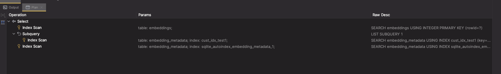

# CIP-X Metadata Indexes

## WARNING: Challenges to discuss

- One of the main challenges with the below proposal is that indices are not per collection and defining them at
  collection level feels counter-intuitive.
- Another challenge is that string_value also contains the actual documents which means that the index will be very
  large and will not be very efficient.

## Status

Current Status: `Under Discussion`

## Motivation

Currently, some users are experiencing extreme slowness when querying with metadata filters, more frequently occurring
for large datasets. Investigation into the issue has found that when performing WHERE operations on metadata columns SQLite scans the full table.
The issue is particularly noticeable when a comparison operator `<`, `>`, `<=`, `>=` is used as the query will need to scan the full table to find the relevant entries.

## Public Interfaces

The proposal suggests the introduction of the following public API interfaces:

- `/api/v1/collection/{collection_id}/indices` - (POST, GET, DELETE) - allows users to define indices on the collection
  and get a list of all defined indices on the collection.
    - `POST` - allows users to define indices on the collection
    - `GET` - allows users to get a list of all defined custom indices on the collection
    - `DELETE` - allows users to drop one, multiple or all indices from the collection
- `/api/v1/collection/{collection_id}/indices/{index_name}` where:
    - `DELETE` - allows users to drop an individual index
    - `PATCH` - allows the user to perform an operation on the index, for now only `rebuild` is supported

In addition to the API changes above we propose the following `Collection` interface changes:

- `Collection.add_indices([index_def])` - allows users to define indices on the collection - this is a convenience method that
  delegates to the API endpoint above (`POST /api/v1/collection/{collection_id}/indices`)
- `Collection.list_indices()` - allows users to get a list of all defined indices on the collection - this is a
  convenience
  method that delegates to the API endpoint above (`GET /api/v1/collection/{collection_id}/indices`)
- `Collection.delete_indices(['index_name'])` - allows users to drop one or more indices from the collection - this will
  rely on  `DELETE /api/v1/collection/{collection_id}/indices`
  and `DELETE /api/v1/collection/{collection_id}/indices/{index_name}` to achieve the desired result
- `Collection.rebuild_indides('index_name')` - allows the user to perform an operation on the index e.g. rebuild -
  this is a convenience method that delegates to the API endpoint
  above (`PATCH /api/v1/collection/{collection_id}/indices/{index_name}`)

## Proposed Changes

This proposal introduces the following domain models:

- `DocumentMetadataIndex` - represents an index on a collection

### The `DocumentMetadataIndex` model

We propose two variations of the `DocumentMetadataIndex` model.


_**Common Structures**_

```python
class ColumnType(str, Enum):
    STRING = "string_value"
    INT = "int_value"
    FLOAT = "float_value"
```

The variation below is more flexible and fine-grained as it allows users to define what metadata keys and for which data type to be indexed.

```python
class DocumentMetadataIndex(TypedDict):
  name: str
  keys: Dict[str, ColumnType]
```

The variation below is less flexible and fine-grained as it only allows users to define what metadata keys to be indexed. Under the hood, Chroma will index the given key for all possible data types.

```python
class DocumentMetadataIndex(TypedDict):
    name: str
    keys: Set[str]
```


### Examples

#### Add indices

```python
# variant 1
collection.add_indices([DocumentMetadataIndex(name="my_index", keys={"my_metadata_key":ColumnType.STRING})])

# variant 2
collection.add_indices([DocumentMetadataIndex(name="my_index", keys={"my_metadata_key"})])
```

#### Rebuild indices

```python
# rebuild specific indices
collection.rebuild_indices(["my_index"])

# rebuild all indices
collection.rebuild_indices()
```

#### Drop indices

```python
# drop specific indices
collection.drop_indices(["my_index", "my_index2"])

# drop all indices
collection.drop_indices()
```

#### Get indices

```python
collection.list_indices()
```

### Implementation Details

We suggest that all indices created by means described in this CIP are prefixed with `custom_idx_` to avoid any
potential conflicts with the indices created by the system via the migration scripts.

The actual SQLite indices will be partial once and can be fine-grained down to metadata key and data type.
Below is an example of index on string_value for two metadata keys:

```sql
CREATE INDEX cust_idx_test1 ON "embedding_metadata" (key, segment_id, string_value) WHERE "key" <> 'chroma:document' AND
                                                                                          "segment_id" =
                                                                                          '13575348-e791-49f3-b8fa-fd95795ad510' AND
                                                                                          ("key" = 'data' OR "key" = 'test1')
```

The resulting query `EXPLAIN` shows that metadata index search happens on the custom index:



### Additional Considerations

#### API Surface

The propose change will increase the API surface.

#### Applicability

This CIP is only intended to be applied to SQLite or other compatible SQL databases where the functionality can be 
reasonably implemented.

## Compatibility, Deprecation, and Migration Plan

This feature does not introduce breaking changes and legacy code should continue to work as expected.

Cross client-server compatability is impacted in such that older servers will not work with newer client requiring
the metadata indices functionality.

## Test Plan

We plan to introduce a new set of property tests to validate the behaviour of the new extension.

## Rejected Alternatives

The following alternatives were considered:

- Brute-force indexes on all columns - this solution may seam like a simple and straightforward but has the distinct
  drawbacks of not being very flexible with user requirements e.g. composite indexes where column orders matters.
- Allow users to define indices manually on the SQLite directly - this solution while being probably the simplest is not
  very developer friendly, some users do not have indepth knowledge of SQLite and it's indexing capabilities.
- Implement a mechanism to allow users to configure indices at startup - this solution is only a part of the suggested
  approach above and can only be implemented server-side and is less flexible due to indices being defined at startup.
