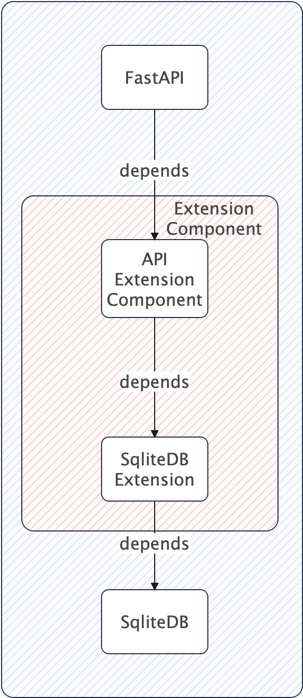

# CIP-X Metadata Indexes

## Status

Current Status: `Under Discussion`

## Motivation

Currently users are experiencing extreme slowness when querying with metadata filters, more frequently occurring for
large datasets. This behaviour is due to the full table scan that metadata filters (WHERE clauses) must perform to
locate the relevant documents.

## Public Interfaces

This proposal suggest new publicly available API interface to allow users to manage metadata indexes.

The proposal introduces one new endpoint with several verbs:

- `POST /_admin/metadata_indexes` - Create a new metadata indexes and removes existing ones
- `GET /_admin/metadata_indexes` - Get all metadata indexes
- `GET /_admin/metadata_index/{index_name}` - Get a specific metadata index
- `DELETE /_admin/metadata_index/{index_name}` - Delete a specific metadata index
- `POST /_admin/metadata_index/{index_name}/rebuild` - Rebuild a specific metadata index
- `PUT /_admin/metadata_index/{index_name}/` - Update a specific metadata index
- `DELETE /_admin/metadata_indexes` - Delete all metadata indexes

We suggest a very simple request payloads for the `POST` and `PUT` endpoints:

```json
{
  "index_name": "my_index",
  "columns": [
    "string_value"
  ]
}
```

## Proposed Changes

We propose the introduction of a two new abstractions:

- API Extension - A component that can be added injected as middleware to API implementations.
- SQLiteDBExtension - A component that allows extending the SQLite database capabilities

Following is a dependency graph of components:



In the above approach we propose that Extension Modules are defined as a list of classes to be loaded in the
configuration which are then loaded from within the API implementation (FastAPI).

To facilitate with future extensions we suggest also the introduction of decorators that will expose the extension's
annotated methods to the API without requiring an actual API implementation. The benefits we see with this approach is
that if the API implementation is to change in the future, the extension will not need to be modified.

### API Extension

This proposal introduces new API extension `MetadataIndexExtensionAPIExtension` - Exposing the API and business logic
required to manage metadata indexes.

For proposed interface see the section on `Public Interfaces`.

### SQLiteDB Extension

We also propose the introduction of a new SQLite extension `MetadataIndexSQLiteExtension` - Implementing SQLite index
management functionality.

We suggest the following interface:

- `create_index` - create new index
- `get_index` - get index by name
- `rebuild_index` - rebuild existing index
- `delete_index` - drop existing index
- `get_indexes` - get all indexes
- `delete_indexes` - drop all indexes

We propose that all indexes created by this extension must be prefixed with an appropriate prefix to avoid name clashes.

### Pros and Cons

Pros:

1. **Flexibility**: Developers can optimize searches and performance.
2. **Ease of Integration**: Simplifies complex operations for third-party users.
3. **Customization**: Allows developers to tailor the database to their needs.
4. **Runtime Configuration**: Indexes can be created dynamically at runtime (no additional configuration required)
5. **Portability**: The solution can easily be ported to distributed version of Chroma (assuming SQL-backed metadata store)


Cons:

1. **Complexity**: Index management can introduce bugs or inefficiencies when done incorrectly
    1. Mitigation: Introduce advanced documentation + examples how to do indexes right
    2. Mitigation: Validate user input and provide good feedback
    3. Mitigation: Debug logging so that users can get better support on issues from Team and Community
2. **Security**: Potential vulnerabilities if not implemented securely.
    1. Mitigation: Admin endpoint will be secured with Auth
    2. Mitigation: RBAC will be added as part of authZ
3. **Overhead**: More API endpoints and logic to maintain.
    1. Mitigation: Good testing coverage with property tests/hypothesis
    2. Mitigation: Logging
    3. Mitigation: _admin can be reused further down the road for additional admin related functionality
    4. Mitigation: Reduce the implementation to the bear minimum
    5. Mitigation: For future versions this can redirect to a separate admin API backend

## Compatibility, Deprecation, and Migration Plan

This change is backward compatible. It is possible to also create a separate backport module to allow slightly older
versions in the 0.4.x series to use the new extension.

## Test Plan

We plan to introduce a new set of property tests to validate the behaviour of the new extension.

## Rejected Alternatives

The following alternatives were considered:

- Brute-force indexes on all columns - this solution may seam like a simple and straightforward but has the distinct
  drawbacks of not being very flexible with user requirements e.g. composite indexes where column orders matters.
- Allow users to define indices manually on the SQLite directly - this solution while being probably the simplest is not
  very developer friendly, some users do not have indepth knowledge of SQLite and it's indexing capabilities.
- Implement a mechanism to allow users to configure indices at startup - this solution is only a part of the suggested
  approach above and can only be implemented server-side and is less flexible due to indices being defined at startup.
