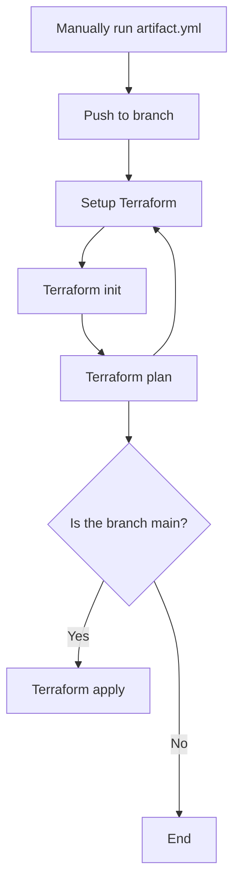

# Google Cloud Compute Deployment

This is an example deployment to Google Cloud Compute using [terraform] (https://www.terraform.io/) and Github Actions for CI/CD.

If you already have a service account setup in GCP, you can skip step 1-3 and simply copy this template repository.

Make sure to change variables in Terraform to match your needs. The pipeline will automatically read any files in the root directory, to change this one may add working_directory under defaults in `.github/workflows/terraform.yml`.

Below example shows how one may make it default into directory `/tf` instead.

```defaults:
      run:
        shell: bash
        working-directory: ./tf
```

## Deployment with GitHub Actions

### 1. Auth to your Google Cloud project

```bash
gcloud auth application-default login
```

### 2. Create a service account

```bash
gcloud iam service-accounts create SA_NAME \
    --description="DESCRIPTION" \
    --display-name="DISPLAY_NAME"
```

### 3. Give your service account necessary IAM permissions

Best practice is to limit the IAM permissions to the minimum, which in this case would be a role which can create a bucket, create a VM, and upload to artifact Registry.

To make testing easier, general roles such as project/editor or project/owner can be applied, but should not be used in production.

```bash
gcloud projects add-iam-policy-binding PROJECT_ID \
    --member="serviceAccount:SA_NAME@PROJECT_ID.iam.gserviceaccount.com" \
    --role="ROLE_NAME"
```

### 4. Create credentials

Follow these instructions to create credentials for the service account previously created: https://developers.google.com/workspace/guides/create-credentials#create_credentials_for_a_service_account

After the credentials have been created go to your repositories settings.

1. Click `Secrets and variables`
2. Click `Actions`
3. Paste the service account credentials from the JSON file created in the step before. Name the secret `GOOGLE_CREDENTIALS`.

### 6. Create a standard artifact registry and change values in artifact.yml

Follow these instructions to create a standard repository: https://cloud.google.com/artifact-registry/docs/repositories/create-repos

Then change the env values in `.github/workflows/artifact.yml` to what you picked.
Example below

```
env:
  PROJECT_ID: my-demo-project-118839
  REGION: europe-north1
  CONTAINER_REGISTRY: chroma-db-server-registry
  IMAGE: chroma-db-server
```

### 7. Deploy your application

Any changes to main will now be deployed directly to a Google Compute Engine running ChromaDB

## How the CI/CD pipeline works


