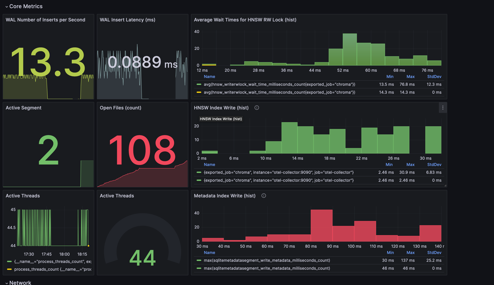

# Chroma Full Observability Primer

## Running

> Note: This is an example and is not meant to be exhaustive or production-ready.

```bash
docker compose -f examples/observability/full-observability/docker-compose.yaml up --build -d
```

Navigate to Grafana on `http://localhost:3000/` and login with `admin:admin` (you can skip the change of password).

Under dashboards, you will find the `Chroma Basic` dashboard.

> Note: The dashboard is read-only, if you need to modify it, you can save it as a new dashboard and modify the new one.

## Stopping

```bash
docker compose -f examples/observability/full-observability/docker-compose.yaml down --volumes --rmi
```

## Dashboard Examples

**Core Metrics:**



**Network:**


**Memory and CPU:**


**Logs:**


