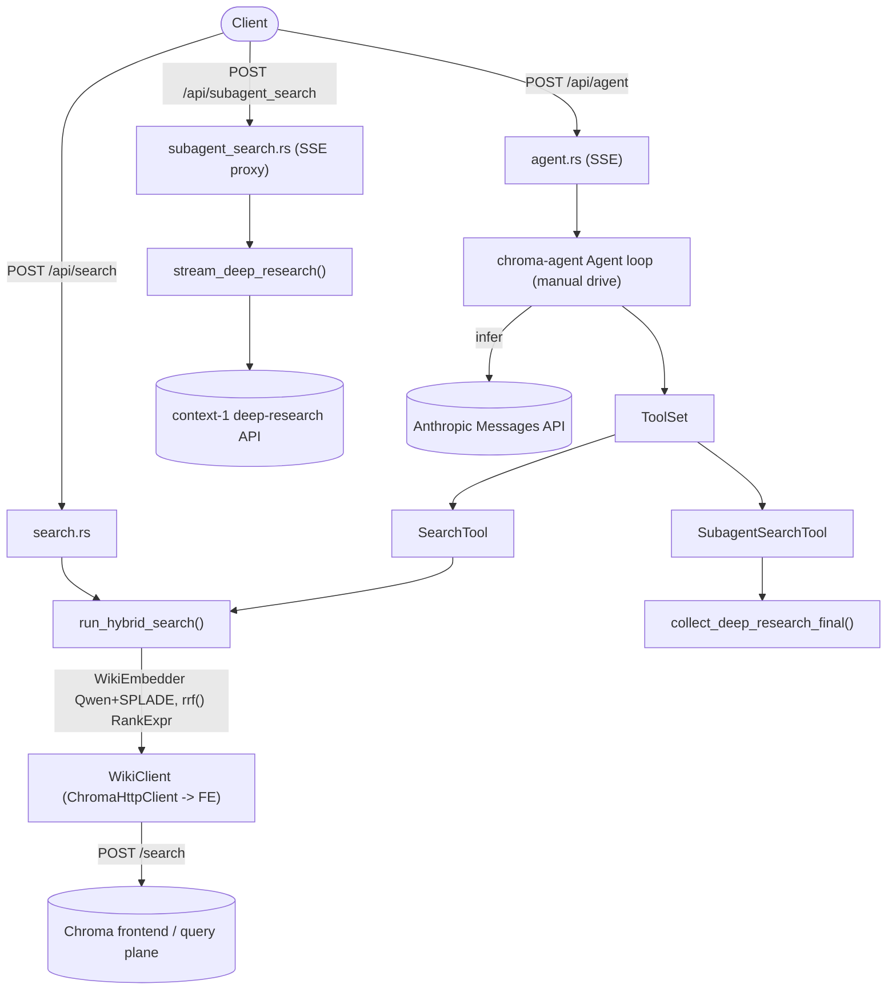
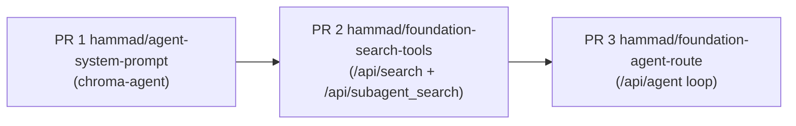

# Foundation `/agent` loop + `/search` and `/subagent_search` tools

## Goal

Three new routes on `foundation-api`, sharing core logic between a plain route and a `chroma-agent` tool:

- `POST /api/search` — hybrid dense+sparse search with RRF over the fixed wiki collection (JSON response).
- `POST /api/subagent_search` — proxy to the external "context-1" deep-research API (SSE passthrough).
- `POST /api/agent` — SSE-streaming agent loop using `chroma-agent`, with a selectable Anthropic model and both tools registered.

Decisions (confirmed): retrieval reuses the existing `WikiClient` (a scoped `ChromaHttpClient` proxy to `frontend_ingress_url`) rather than a new client; `/agent` streams SSE (mirroring OpenAI/Anthropic `stream: true` and the Python reference); Anthropic models only (`Opus4_5`/`Sonnet4_5`), key from `ANTHROPIC_API_KEY`; collection fixed to the foundation wiki collection.

### Post-rebase reuse (what main already provides)
The rebase added most of the data-plane plumbing this plan originally specified. Reuse it instead of re-building:
- [`WikiClient`](rust/foundation-api/src/wiki/client.rs) — a `ChromaHttpClient` built from `frontend_ingress_url`, with `scoped_client(tenant, token)` (uses the caller's `x-chroma-token` + `database_name`) and `wiki_collection(tenant, token) -> ChromaCollection` (cached per tenant). Stored on `FoundationApiServer.wiki_client: Option<WikiClient>`. **This replaces the planned `chroma_client.rs` helper and the `query_endpoint_url` config field** (use `frontend_ingress_url`).
- [`WikiEmbedder`](rust/foundation-api/src/wiki/embed.rs) — runtime SPLADE via `ChromaCloudSpladeEmbeddingFunction` (`embed_sparse(token, docs)`), auth'd by the caller's token, endpoint from `CHROMA_EMBED_URL`/SDK default. **Only the dense Qwen query path is missing** (see Changes §3).
- Auth/creds pattern: per-request `x-chroma-token` (helper `chroma_token(headers)` in `upsert_page.rs`), tenant from `whoami_and_authorize`, database from `config.foundation.database_name`. **No `CHROMA_API_KEY` env** — drop that from the original plan.

## Architecture



Key insight from research: the Chroma `/search` endpoint does **not** embed query text — the caller supplies dense+sparse vectors. RRF is the `rrf(vec![dense_knn, sparse_knn], k, weights, normalize)` helper in `rust/types` (re-exported from `chroma::types`) that expands two `$knn` nodes with `return_rank: true`. Reference: [rust/chroma/examples/collection_search.rs](rust/chroma/examples/collection_search.rs) lines 372-401 and [rust/types/src/execution/operator.rs](rust/types/src/execution/operator.rs) `rrf` at 2868.

## Changes

### 1. Config — [rust/foundation-api/src/config.rs](rust/foundation-api/src/config.rs)
Add **one** field to `FoundationConfig` (same `Option<String>` pattern as `function_endpoint_url`):
- `deep_research_api_url: Option<String>` — base URL of the context-1 deep-research API (e.g. `https://chroma-core--search-agent-api-serve.modal.run`).

Do **not** add a query endpoint URL — reuse the existing `frontend_ingress_url` (already drives `WikiClient`). Handlers read `server.config.foundation.*`; a missing `deep_research_api_url` disables `/api/subagent_search` and the subagent tool (return a typed `RouteDisabled`-style error, mirroring how `wiki_client == None` disables `/api/upsert-page`). Creds are the per-request `x-chroma-token` + tenant from `whoami_and_authorize` + `database_name` from config — no `CHROMA_API_KEY` env.

### 2. Dependencies + shared HTTP client — [rust/foundation-api/Cargo.toml](rust/foundation-api/Cargo.toml), [server.rs](rust/foundation-api/src/server.rs)
`chroma` and `reqwest` are already present after the rebase. Add only: `chroma-agent` (agent loop), `futures` (stream utils), and a new workspace dep `async-stream = "0.3"` (added to root `[workspace.dependencies]`) for building the SSE `Stream`. Axum SSE uses `axum::response::sse::{Sse, Event, KeepAlive}` (already available via the workspace `axum`).

Add a shared `http_client: reqwest::Client` field to `FoundationApiServer` (built once at startup). It is cloned per request into the Anthropic model (`with_client`), the deep-research stream, and embedding functions where supported, so connection pools are reused rather than recreated.

### 3. Dense query embedding — thin wrapper in [rust/foundation-api/src/wiki/embed.rs](rust/foundation-api/src/wiki/embed.rs)
The dense embedding function **already exists** in the rust client: [`ChromaCloudQwenEmbeddingFunction`](rust/chroma/src/embed/chroma_cloud.rs) (sibling of the SPLADE one `WikiEmbedder` already uses). It implements `EmbeddingFunction::embed_query_strs`, which applies the **query-side instruction** (vs `embed_strs` for documents) — exactly what query embedding needs. So this is *not* new embedding logic; just a ~10-line `WikiEmbedder::embed_dense(token, queries) -> Vec<Vec<f32>>` that builds the function and calls `embed_query_strs`, mirroring the existing `embed_sparse`.
- Build via `ChromaCloudQwenEmbeddingFunction::builder().api_key(token)` matching the wiki collection's EF (model `Qwen/Qwen3-Embedding-0.6B`, task + instructions per `qwen_embedding_function()` in [init.rs](rust/foundation-api/src/routes/init.rs)) so query and document vectors share a space.
- Note: the exact config-driven constructor `ChromaCloudQwenEmbeddingFunction::try_from_config(&EmbeddingFunctionNewConfiguration, client_api_key)` is `pub(crate)`. To reconstruct the EF directly from the collection's stored config (avoiding duplicating init's task/instructions), either promote a public constructor in `rust/chroma`, or mirror init's builder config in foundation-api. Default: mirror init's config for now.
- Sparse query vector: reuse the existing `embed_sparse` (SPLADE's `embed_query_strs` defaults to `embed_strs`, so query == document — fine).

No new `chroma_client.rs` — the search path resolves its collection through `WikiClient::wiki_collection(tenant, token)`.

### 4. `/api/search` — `rust/foundation-api/src/routes/search.rs` (new)
- `SearchParams { query: String, limit: Option<u32> }`, `SearchHit { id, document, score, metadata }`.
- Core `run_hybrid_search(collection: &ChromaCollection, embedder: &WikiEmbedder, token, params) -> Vec<SearchHit>`:
  1. `embedder.embed_dense(token, &[query])` and `embedder.embed_sparse(token, &[query])` (caller-token-authed, client-side).
  2. Build `rrf(vec![dense_knn(Key::Embedding), sparse_knn(Key::field("sparse_embedding"))], Some(60), None, false)` with `return_rank: true` on both KNN nodes.
  3. `collection.search(vec![SearchPayload::default().rank(rrf).limit(Some(limit),0).select([Key::Document, Key::Score, Key::Metadata])])`, map to hits.
- Handler `foundation_search`: `whoami_and_authorize(AuthzAction::ViewFoundation)`, scorecard guard, `token = chroma_token(headers)`, `collection = server.wiki_client.as_ref().ok_or(RouteDisabled)?.wiki_collection(tenant, token).await?`, call core, return `Json<Vec<SearchHit>>`.

### 5. `/api/subagent_search` — `rust/foundation-api/src/routes/subagent_search.rs` (new)
Deep-research API contract (from [search_agent_client.py](file:///Users/hammad/Documents/search_agent_research/inference/search_agent_client.py)): `POST {url}/search` with `{query, model, collection_name, chroma_api_key, chroma_tenant, chroma_database}`, `Accept: text/event-stream`; SSE `data:` lines of `{type: action|observation|done|error, data}`. (`use_nx1_prompt` is not exposed — rely on the upstream default.)
- `stream_deep_research(url, creds, params) -> impl Stream<Item=Event>`: reqwest streaming POST, forward upstream SSE lines as axum SSE events. `creds` = `{ chroma_api_key: x-chroma-token, chroma_tenant: identity.tenant, chroma_database: config.database_name, collection_name: config.wiki_collection }`.
- `collect_deep_research_final(...) -> String`: consume the stream, return the final `user_text` from the last `action` (the terminal answer) — used by the tool.
- Handler `foundation_subagent_search`: `whoami_and_authorize(AuthzAction::ViewFoundation)` + scorecard, resolve `deep_research_api_url` (else `RouteDisabled`), return `Sse` proxying `stream_deep_research`.

### 6. Agent tools — `rust/foundation-api/src/agent_tools/{mod.rs,search_tool.rs,subagent_search_tool.rs}` (new)
Each implements `chroma_agent::Tool`, carrying per-request state as struct fields (no `RuntimeParams` needed; `type RuntimeParams = ()`). State is resolved once in the `/api/agent` handler (collection via `WikiClient`, token from headers):
- `SearchTool { collection: ChromaCollection, embedder: WikiEmbedder, token: String }`: `ModelSuppliedParams { query, limit }`; `call()` runs `run_hybrid_search` and formats hits into a text block for the model. `name = "search"`.
- `SubagentSearchTool { http, url, creds, model }`: `ModelSuppliedParams { query }`; `call()` runs `collect_deep_research_final` and returns the text. `name = "subagent_search"`.

### 7. Agent crate — system prompt (generic) + reusable HTTP client — [agent.rs](rust/agent/src/agent.rs), [inference/mod.rs](rust/agent/src/inference/mod.rs), [inference/anthropic.rs](rust/agent/src/inference/anthropic.rs)
Decision (answering "should it be on the inference-model trait / a provider thing?"): **no to provider-specific.** The system prompt is part of the *agent definition* and should have a generic entrypoint. It is the same shape as `max_tokens`, which already lives on `InferenceContext` and is set generically: the `AgentBehavior::prepare_for_inference(&mut ctx)` hook exists precisely to project run-level config into each per-call view. So:
- Add `system: Option<String>` to `InferenceContext` (generic field, alongside `max_tokens`). This is the provider-agnostic transport; only the wire-rendering is provider-specific.
- Add `Agent::with_system_prompt(impl Into<String>)` storing `system_prompt: Option<String>` (the agent-definition entrypoint). In `Agent::infer`, initialize `ctx.system = self.system_prompt.clone()` **before** running `prepare_for_inference`, so a behavior can override it via the existing hook (the "behavior" route — no new hook needed).
- `AnthropicAgentInferenceModel::request_body` reads `ctx.system` and emits top-level `"system"` when present. The `AgentInferenceModel` trait is unchanged.

This keeps ownership at the agent/behavior layer (run-constant source of truth), uses the generic `InferenceContext` as transport (matching `max_tokens`), and confines provider knowledge to wire rendering — not a per-provider `with_system_prompt`.

Separately (connection-pool reuse, see §8): `AnthropicAgentInferenceModel::new` does `reqwest::Client::new()`, creating a fresh pool per construction. Add `with_client(reqwest::Client)` / `new_with_client(...)` so the `/agent` route injects a shared client and reuses its pool.

### 8. `/api/agent` — `rust/foundation-api/src/routes/agent.rs` (new)
- `whoami_and_authorize(AuthzAction::ViewFoundation)` + scorecard.
- `AgentParams { query: String, model: String }`; map `model` -> `AnthropicModel` (`"opus"|"opus-4.5" => Opus4_5`, `"sonnet"|"sonnet-4.5" => Sonnet4_5`), else 400.
- Resolve `token`/`tenant`, build the wiki `ChromaCollection` via `WikiClient`, a `WikiEmbedder`, and the deep-research creds.
- Build `AnthropicAgentInferenceModel::from_env(model).with_client(shared_http)` (provider/transport config only), a `ToolSet` with `SearchTool` + `SubagentSearchTool`, and `Agent::new(toolset, Box::new(model)).with_system_prompt(SEARCH_SYSTEM_PROMPT)` (the system prompt is set on the agent, not the model).
- **Connection-pool reuse**: hold a shared `reqwest::Client` on `FoundationApiServer` (clone it into the Anthropic model via `with_client`, into the deep-research stream, and — where possible — into the embedding functions). `reqwest::Client` is `Clone` and clones share one pool, so clone-per-request is cheap; constructing fresh clients per request is not. `WikiClient`'s `ChromaHttpClient` already reuses its own pool.
- Drive manually inside an `async_stream::stream!` (spawned with an mpsc sender; `Agent` is `Send`), emitting SSE events that mirror the reference schema:
  - `reset()`, `observe(ObservationBuilder::push_user(query))`
  - loop: `infer()` -> emit `{type:"action", data:{step, reasoning, tools:[{name,params}]}}`; `act()` -> emit `{type:"observation", data:{step, results:[{call_id,text}]}}` and `observe`; until `is_done()` or `infer` -> None.
  - terminal: `{type:"done", data:{final_text, trajectory}}`; on error `{type:"error", data:{message}}`.
- Return `Sse::new(stream).keep_alive(KeepAlive::default())`.

### 9. Register routes — [rust/foundation-api/src/routes/mod.rs](rust/foundation-api/src/routes/mod.rs)
Add `mod search; mod subagent_search; mod agent;` and:
```rust
Router::new()
    .route("/api/init", post(init::foundation_init))
    .route("/api/search", post(search::foundation_search))
    .route("/api/subagent_search", post(subagent_search::foundation_subagent_search))
    .route("/api/agent", post(agent::foundation_agent))
```
Authz: reuse the existing `AuthzAction::ViewFoundation` (the foundation "viewer" level) for all three routes — they are read/retrieval paths. No new `AuthzAction` variant needed.

## PR stack

Three stacked PRs, each branch off the previous. PR 1 is `chroma-agent`-only and independent; PRs 2–3 are foundation-api and build on it.



### PR 1 — `hammad/agent-system-prompt`
- Scope (todo: `system-prompt`): in `chroma-agent`, add `system: Option<String>` to `InferenceContext`; `Agent::with_system_prompt` (seeded into `ctx.system` before `prepare_for_inference`, so behaviors can override); render top-level `"system"` in `AnthropicAgentInferenceModel::request_body`; add `with_client(reqwest::Client)` for pool reuse. Trait unchanged.
- Test plan:
  - Unit: `Agent::with_system_prompt` value reaches `ctx.system`; `request_body` includes top-level `system` when set and omits it by default.
  - Unit: a stub `prepare_for_inference` behavior overrides `ctx.system`.
  - Unit: `with_client` stores the injected client (e.g. construct two models from one client; assert no panic / pool reuse via type).
  - `cargo test/clippy/fmt -p chroma-agent` clean; existing live Anthropic `#[ignore]` test still compiles.

### PR 2 — `hammad/foundation-search-tools`
- Scope (todos: `config`, `deps`, `embed-dense`, `search`, `subagent`): add `deep_research_api_url` to `FoundationConfig` (reuse `frontend_ingress_url` for the query plane); add `chroma-agent`/`futures`/workspace `async-stream` deps + shared `http_client` on `FoundationApiServer`; add `WikiEmbedder::embed_dense`; implement `run_hybrid_search` + `POST /api/search`; implement deep-research stream/collect cores + `POST /api/subagent_search` (SSE). Both routes use `AuthzAction::ViewFoundation`. No agent loop yet.
- Test plan:
  - Unit: config parse for `deep_research_api_url` (present + fail-closed when absent, mirroring `function_endpoint_url`).
  - Unit: `run_hybrid_search` builds the RRF `SearchPayload` — two `$knn` nodes, `return_rank: true`, sparse key `sparse_embedding` — without network.
  - Unit: deep-research SSE parser turns a canned transcript into forwarded events / final text.
  - Integration (offline, `httpmock` already a dev-dep): `/api/search` against a mocked FE search response; `/api/subagent_search` against a mocked upstream SSE stream.
  - Manual/live (`#[ignore]`): `/api/search` and `/api/subagent_search` against a real deployment.
  - `cargo build/clippy/fmt -p foundation-api` clean.

### PR 3 — `hammad/foundation-agent-route`
- Scope (todos: `tools`, `agent-route`, `register`, `tests`): implement `SearchTool` + `SubagentSearchTool` (`chroma-agent` `Tool` impls over the PR-2 cores); implement `POST /api/agent` SSE route driving the loop with a selectable Anthropic model, `with_client(shared_http)` + `with_system_prompt`; register all three routes in `routes/mod.rs`.
- Test plan:
  - Unit: model-string mapping (`opus`/`sonnet` → `AnthropicModel`, unknown → 400).
  - Unit: offline agent loop with a stub inference model + stub tools, asserting the SSE event order (`action` → `observation` → `done`), incl. a tool-error path surfaced as an observation (per `ToolErrorPolicy::ReportToModel`).
  - Manual/live (`#[ignore]`, `ANTHROPIC_API_KEY` + deployment): end-to-end `/api/agent` run that calls `search`/`subagent_search`.
  - `cargo build/clippy/fmt -p foundation-api` clean.

## Testing
- `chroma-agent`: unit test that `Agent::with_system_prompt` lands as `InferenceContext.system` and that `AnthropicAgentInferenceModel::request_body` emits top-level `system` (omitted by default); plus a test that a `prepare_for_inference` behavior can override `ctx.system`.
- `search.rs`: unit test building the RRF `SearchPayload` (assert two `$knn` nodes, `return_rank: true`, sparse key `sparse_embedding`) without network.
- `subagent_search.rs`: unit test parsing a canned SSE transcript into the final text.
- `agent.rs`: offline test driving the loop with a stub inference model + stub tools, asserting the SSE event sequence (action -> observation -> done). Live Anthropic/deep-research paths gated behind env (`#[ignore]`), per repo convention.
- `cargo build/clippy/fmt -p foundation-api` and `-p chroma-agent` clean.

## Open items / deploy inputs
- `deep_research_api_url` is deploy-provided (no default, fail-closed; route/tool disabled when unset). The reference default is `https://chroma-core--search-agent-api-serve.modal.run`. The query plane reuses the already-configured `frontend_ingress_url`.
- Confirm the wiki collection's sparse index key is `sparse_embedding` (matches init schema) and that the dense Qwen query EF config matches the collection's (`Qwen/Qwen3-Embedding-0.6B`, `generic_retrieval`) so vectors share a space.
- The Anthropic inference model is non-streaming, so `/agent` SSE is step-level (action/observation), not token-level — consistent with the Python reference.
