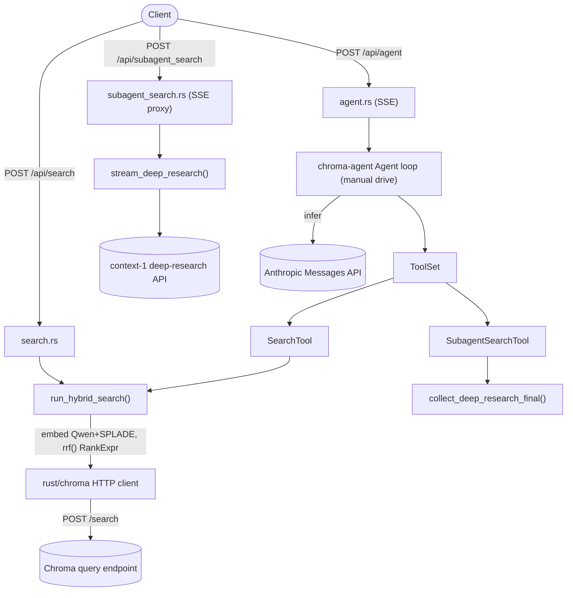

# Foundation `/agent` loop + `/search` and `/subagent_search` tools

## Goal

Three new routes on `foundation-api`, sharing core logic between a plain route and a `chroma-agent` tool:

- `POST /api/search` — hybrid dense+sparse search with RRF over the fixed wiki collection (JSON response).
- `POST /api/subagent_search` — proxy to the external "context-1" deep-research API (SSE passthrough).
- `POST /api/agent` — SSE-streaming agent loop using `chroma-agent`, with a selectable Anthropic model and both tools registered.

Decisions (confirmed): retrieval via the `rust/chroma` HTTP client against a configured Chroma query endpoint; `/agent` streams SSE (mirroring OpenAI/Anthropic `stream: true` and the Python reference); Anthropic models only (`Opus4_5`/`Sonnet4_5`), key from `ANTHROPIC_API_KEY`; collection fixed to the foundation wiki collection.

## Architecture



Key insight from research: the Chroma `/search` endpoint does **not** embed query text — the caller supplies dense+sparse vectors. RRF is the `rrf(vec![dense_knn, sparse_knn], k, weights, normalize)` helper in `rust/types` (re-exported from `chroma::types`) that expands two `$knn` nodes with `return_rank: true`. Reference: [rust/chroma/examples/collection_search.rs](rust/chroma/examples/collection_search.rs) lines 372-401 and [rust/types/src/execution/operator.rs](rust/types/src/execution/operator.rs) `rrf` at 2868.

## Changes

### 1. Config — [rust/foundation-api/src/config.rs](rust/foundation-api/src/config.rs)
Add to `FoundationConfig` (same `Option<String>` pattern as `function_endpoint_url`):
- `query_endpoint_url: Option<String>` — base URL of the Chroma query frontend the `rust/chroma` client targets.
- `deep_research_api_url: Option<String>` — base URL of the context-1 deep-research API (e.g. `https://chroma-core--search-agent-api-serve.modal.run`).

Handlers read `server.config.foundation.*`; missing values produce a typed `ChromaError` (mirror `MissingFunctionEndpointUrl` in [init.rs](rust/foundation-api/src/routes/init.rs)). `CHROMA_API_KEY` env supplies both the client cloud token and the embedding-function key; tenant/database come from the auth identity (`whoami_and_authorize`).

### 2. Dependencies — [rust/foundation-api/Cargo.toml](rust/foundation-api/Cargo.toml)
Add: `chroma` (HTTP client, embeddings, search types), `chroma-agent` (agent loop), `reqwest` (json), `futures`, and a new workspace dep `async-stream = "0.3"` (added to root `[workspace.dependencies]`) for building the SSE `Stream`. Axum SSE uses `axum::response::sse::{Sse, Event, KeepAlive}` (already available via the workspace `axum`).

### 3. Chroma client helper — `rust/foundation-api/src/chroma_client.rs` (new)
- `build_client(cfg, tenant, database) -> ChromaHttpClient` using `ChromaHttpClientOptions` with `endpoint = query_endpoint_url`, `ChromaAuthMethod::cloud_api_key(CHROMA_API_KEY)`, tenant, database.
- `wiki_collection(client, cfg) -> ChromaCollection` via `client.get_collection(cfg.wiki_collection)`.
- Build the Qwen dense + SPLADE sparse embedding functions (`chroma::embed::chroma_cloud::ChromaCloudQwenEmbeddingFunction` / `...SpladeEmbeddingFunction` builders, `api_key_env_var("CHROMA_API_KEY")`, models `Qwen/Qwen3-Embedding-0.6B` and `prithivida/Splade_PP_en_v1` — matching [init.rs](rust/foundation-api/src/routes/init.rs) lines 329-358).

### 4. `/api/search` — `rust/foundation-api/src/routes/search.rs` (new)
- `SearchParams { query: String, limit: Option<u32> }`, `SearchHit { id, document, score, metadata }`.
- Core `run_hybrid_search(collection, qwen, splade, params) -> Vec<SearchHit>`:
  1. `qwen.embed_query_strs(&[query])` and `splade.embed_query_strs(&[query])` (client-side).
  2. Build `rrf(vec![dense_knn(Key::Embedding), sparse_knn(Key::field("sparse_embedding"))], Some(60), None, false)` with `return_rank: true` on both KNN nodes.
  3. `collection.search(vec![SearchPayload::default().rank(rrf).limit(Some(limit),0).select([Key::Document, Key::Score, Key::Metadata])])`, map to hits.
- Handler `foundation_search`: `whoami_and_authorize(AuthzAction::Search)`, scorecard guard, build client/collection/embedders, call core, return `Json<Vec<SearchHit>>`.

### 5. `/api/subagent_search` — `rust/foundation-api/src/routes/subagent_search.rs` (new)
Deep-research API contract (from [search_agent_client.py](file:///Users/hammad/Documents/search_agent_research/inference/search_agent_client.py)): `POST {url}/search` with `{query, model, collection_name, chroma_api_key, chroma_tenant, chroma_database, use_nx1_prompt}`, `Accept: text/event-stream`; SSE `data:` lines of `{type: action|observation|done|error, data}`.
- `stream_deep_research(cfg, creds, params) -> impl Stream<Item=Event>`: reqwest streaming POST, forward upstream SSE lines as axum SSE events.
- `collect_deep_research_final(...) -> String`: consume the stream, return the final `user_text` from the last `action` (the terminal answer) — used by the tool.
- Handler `foundation_subagent_search`: auth + scorecard, return `Sse` proxying `stream_deep_research`.

### 6. Agent tools — `rust/foundation-api/src/agent_tools/{mod.rs,search_tool.rs,subagent_search_tool.rs}` (new)
Each implements `chroma_agent::Tool`, carrying per-request state as struct fields (no `RuntimeParams` needed; `type RuntimeParams = ()`):
- `SearchTool { collection, qwen, splade }`: `ModelSuppliedParams { query, limit }`; `call()` runs `run_hybrid_search` and formats hits into a text block for the model. `name = "search"`.
- `SubagentSearchTool { http, url, creds, collection_name, model }`: `ModelSuppliedParams { query }`; `call()` runs `collect_deep_research_final` and returns the text. `name = "subagent_search"`.

### 7. Agent crate — system prompt support — [rust/agent/src/inference/anthropic.rs](rust/agent/src/inference/anthropic.rs)
Add `system: Option<String>` to `AnthropicAgentInferenceModel` with `with_system_prompt(self, String)`; include `"system"` in `request_body` when present. Small additive change so `/agent` can steer the agent (the crate's `prompts.rs` was deferred).

### 8. `/api/agent` — `rust/foundation-api/src/routes/agent.rs` (new)
- `AgentParams { query: String, model: String }`; map `model` -> `AnthropicModel` (`"opus"|"opus-4.5" => Opus4_5`, `"sonnet"|"sonnet-4.5" => Sonnet4_5`), else 400.
- Build `AnthropicAgentInferenceModel::from_env(model).with_system_prompt(SEARCH_SYSTEM_PROMPT)`, a `ToolSet` with `SearchTool` + `SubagentSearchTool`, and `Agent::new(toolset, Box::new(model))`.
- Drive manually inside an `async_stream::stream!` (spawned with an mpsc sender; `Agent` is `Send`), emitting SSE events that mirror the reference schema:
  - `reset()`, `observe(ObservationBuilder::push_user(query))`
  - loop: `infer()` -> emit `{type:"action", data:{step, reasoning, tools:[{name,params}]}}`; `act()` -> emit `{type:"observation", data:{step, results:[{call_id,text}]}}` and `observe`; until `is_done()` or `infer` -> None.
  - terminal: `{type:"done", data:{final_text, trajectory}}`; on error `{type:"error", data:{message}}`.
- Return `Sse::new(stream).keep_alive(KeepAlive::default())`.

### 9. Register routes — [rust/foundation-api/src/routes/mod.rs](rust/foundation-api/src/routes/mod.rs)
Add `mod search; mod subagent_search; mod agent;` and:
```rust
Router::new()
    .route("/api/init", post(init::foundation_init))
    .route("/api/search", post(search::foundation_search))
    .route("/api/subagent_search", post(subagent_search::foundation_subagent_search))
    .route("/api/agent", post(agent::foundation_agent))
```
Add an `AuthzAction::RunAgent` variant in [frontend-core/src/auth.rs](rust/frontend-core/src/auth.rs) if a distinct authz action is wanted (else reuse `Search`).

## Testing
- `chroma-agent`: unit test that `with_system_prompt` puts `system` in the request body.
- `search.rs`: unit test building the RRF `SearchPayload` (assert two `$knn` nodes, `return_rank: true`, sparse key `sparse_embedding`) without network.
- `subagent_search.rs`: unit test parsing a canned SSE transcript into the final text.
- `agent.rs`: offline test driving the loop with a stub inference model + stub tools, asserting the SSE event sequence (action -> observation -> done). Live Anthropic/deep-research paths gated behind env (`#[ignore]`), per repo convention.
- `cargo build/clippy/fmt -p foundation-api` and `-p chroma-agent` clean.

## Open items / deploy inputs
- `query_endpoint_url` and `deep_research_api_url` are deploy-provided (no defaults, fail-closed like `function_endpoint_url`). The deep-research URL default in the reference is `https://chroma-core--search-agent-api-serve.modal.run`.
- Confirm the wiki collection's sparse index key is `sparse_embedding` (matches init schema) and that the query endpoint resolves the wiki collection by name for the request's tenant/database.
- The Anthropic inference model is non-streaming, so `/agent` SSE is step-level (action/observation), not token-level — consistent with the Python reference.
