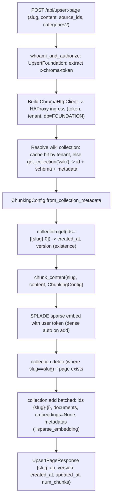
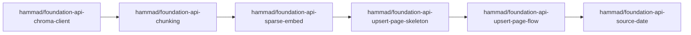

# Add `/upsert-page` to foundation-api

## Goal

A `POST /api/upsert-page` route on `foundation-api` that, given `{ slug, content, source_ids, categories? }`, replaces a wiki page's chunks in the `FOUNDATION`/`wiki` collection: read the `{slug}-0` chunk to preserve `created_at` and bump `version`, delete all chunks where `slug == slug`, then re-chunk + re-embed + re-add — byte-faithfully mirroring `foundation-research`'s `WikiStore.upsert_file`/`_write`.

## Architectural invariant: reuse, don't reimplement

**foundation-api must not reimplement capabilities that already exist elsewhere in the system unless strictly necessary.** It is a thin orchestration layer: it composes foundation-specific logic (chunking, metadata, version/page semantics) on top of existing primitives, and delegates everything else.

- Record I/O (`get`/`delete`/`add`/`query`): proxy to the frontend via the `chroma` SDK — do not embed the data plane.
- Embeddings: use the existing Chroma Cloud embedding functions — do not reimplement embedding.
- Auth, quota, metering, billing, region: let the frontend enforce them on proxied calls — do not duplicate.
- Control-plane ops it already owns (SysDb collection creation in `/init`) stay as-is.

"Necessary" means: the capability genuinely does not exist (e.g. the markdown chunking strategy has no Rust implementation), or reuse is impossible/unsafe for a concrete, documented reason. When reimplementation is unavoidable, prefer extracting/sharing the existing implementation over forking it. This invariant should be formalized as a durable rule (see open item below).

## Architecture decision: proxy to the FE (not in-process)

foundation-api stays a thin orchestrator and acts as a **Chroma client**. It does the foundation-specific work (chunking, embedding, metadata, version logic) and delegates raw record I/O (`get`/`delete`/`add`) to the existing frontend via the `chroma` Rust SDK (`ChromaHttpClient` + `ChromaCollection`). This is exactly what `foundation-research`'s generate flow already does, just in Rust. It avoids extracting `ServiceBasedFrontend` into `frontend-core` and inherits the FE's auth, validation, quota, metering/billing, and region handling for free.

**Routing requirement (HAProxy):** the FE sits behind an HAProxy ingress that consistent-hashes on the collection id in the request path for collections-cache affinity. foundation-api MUST send these calls through the **HAProxy ingress URL**, not the frontend's internal ClusterIP (`frontend-server`) — otherwise the hash-based routing is bypassed and requests can land on the wrong replica. The SDK's collection-scoped data paths (`.../collections/{collection_id}/{get,delete,add}`) already carry the collection id HAProxy hashes on; only the initial get-collection-by-name lookup is a metadata call that may route anywhere.

## Key facts established during research

- `foundation-api` is **control-plane only** today (holds only `SysDb`); it has no record I/O and depends on neither `chroma` nor the data plane. See [rust/foundation-api/src/server.rs](rust/foundation-api/src/server.rs) and [rust/foundation-api/src/lib.rs](rust/foundation-api/src/lib.rs).
- There is **no server-side auto-embed** in the data plane: writes must carry embeddings (compaction rejects log records without one). So vectors are computed client-side, which the SDK does for dense and we do for sparse.
- The `chroma` SDK auto-builds the dense `chroma-cloud-qwen` EF from the collection schema and embeds on `add` when `embeddings` is `None`, using the client's `x-chroma-token` (so dense embed usage bills to the user). See `default_embedding_function`/`resolve_embeddings` in [rust/chroma/src/collection.rs](rust/chroma/src/collection.rs).
- Sparse SPLADE is **not** auto-wired by the SDK: compute it with `ChromaCloudSpladeEmbeddingFunction` ([rust/chroma/src/embed/chroma_cloud.rs](rust/chroma/src/embed/chroma_cloud.rs)) and store the `SparseVector` under the `sparse_embedding` metadata key — pattern shown in [rust/chroma/examples/embeddings.rs](rust/chroma/examples/embeddings.rs). Sparse is a first-class metadata value (`MetadataValue::SparseVector` in [rust/types/src/metadata.rs](rust/types/src/metadata.rs)).
- The chunking algorithm (`tree-sitter-markdown`, 4096-byte greedy block packing, chunk-0 = title line) lives in `foundation-research/src/foundation_research/chunking.py`; no tree-sitter dep or markdown chunker exists in the Rust workspace yet.
- `AuthzAction` is in [rust/frontend-core/src/auth.rs](rust/frontend-core/src/auth.rs) and already has `InitFoundation`/`ViewFoundation`.

## Data flow

## Phase 1 — foundation-api as a Chroma client (proxy)

- [rust/foundation-api/Cargo.toml](rust/foundation-api/Cargo.toml): add `chroma = { path = "../chroma", default-features = false, features = ["rustls"] }`.
- [rust/foundation-api/src/config.rs](rust/foundation-api/src/config.rs): add a `frontend_ingress_url` (HAProxy ingress base URL) to `FoundationConfig`; reuse existing `database_name` (`FOUNDATION`) and `wiki_collection` (`wiki`).
- Add a small client helper (e.g. `rust/foundation-api/src/wiki/client.rs`): given the incoming request's `x-chroma-token` and resolved `tenant`, build a `ChromaHttpClient` pointed at `frontend_ingress_url`, scoped to tenant + `FOUNDATION` db. The client is built per request so the user's token flows through for authz + billing.
- **Cache the resolved wiki collection identity.** Maintain a small cache (key: `tenant`; value: the `Collection` struct — id + schema + metadata) so we avoid a `get_collection("wiki")` metadata round-trip on every request (this lookup is also the one call HAProxy can't hash to the right replica). On a miss, resolve by name once and populate; use a TTL and invalidate on `NotFound` (collection recreated/forked). Cache by tenant, **not** by token — the collection identity is tenant-scoped.
- Build the per-request `ChromaCollection` from the cached `Collection` + the per-request token client (e.g. `ChromaCollection::new(client, cached_collection)`), so the data ops (`get`/`delete`/`add`) hit collection-id paths (HAProxy-hashable) with the user's token, and dense auto-embed wiring from the cached schema still applies.
- No new route yet; gate with a build + a smoke test (resolve + cache the wiki collection against a running FE).

## Phase 2 — Port chunking to Rust

- New `rust/foundation-api/src/wiki/chunking.rs` porting `chunking.py`: `ChunkStrategy {Lines, TreesitterMarkdown}`, `ChunkingConfig {strategy, max_bytes=4096}` with `from_collection_metadata` (fallback `lines`), `Chunk {id, slug, chunk_id, line_no, text}`, `chunk_id_for`, `split_lines`, `chunk_treesitter_markdown`, `_collect_block_units`/`_pack_blocks`/`_pack_lines` (UTF-8 byte budget), `_append_inter_chunk_separators`, `title_from_content`.
- Add `tree-sitter` + `tree-sitter-md` crates. **Parity risk:** confirm the Rust grammar matches Python's `tree-sitter-markdown` block boundaries; port the tests from `foundation-research/tests/test_chunking*.py` to lock parity.

## Phase 3 — Embedding helper

- New `rust/foundation-api/src/wiki/embed.rs`: build `ChromaCloudSpladeEmbeddingFunction` with `.api_key(user_token)`, embed docs in batches of 100 via `embed_strs` → `Vec<SparseVector>`. Dense is left to the collection's Qwen EF on `add` (SDK auto-embeds with the client token), so no explicit dense call is needed; optionally precompute dense the same way if we ever want to bypass auto-embed.

## Phase 4 — `/upsert-page` route

- Add `AuthzAction::UpsertFoundation` (`"foundation:upsert_foundation"`) to [rust/frontend-core/src/auth.rs](rust/frontend-core/src/auth.rs).
- New `rust/foundation-api/src/routes/upsert_page.rs` (`pub async fn foundation_upsert_page`), registered in [rust/foundation-api/src/routes/mod.rs](rust/foundation-api/src/routes/mod.rs) as `POST /api/upsert-page`:
  1. `whoami_and_authorize(.., UpsertFoundation)` (coarse foundation gate); extract `x-chroma-token`; scorecard tag `op:foundation_upsert_page`.
  2. Validate: non-empty `content`, `validate_slug` (`^(?:[a-z0-9][a-z0-9-]*|category:[a-z0-9][a-z0-9-]*|)$`), `source_ids` format `<collection>:<record_id>`, category regex `^[a-z0-9][a-z0-9-]*$`; `categories = sorted(dedup)`.
  3. Build the per-request client and `get_collection("wiki")`; derive `ChunkingConfig` from collection metadata.
  4. `collection.get(ids=[{slug}-0])` → existing `created_at`/`version`; new ⇒ version=1, created_at=now; update ⇒ preserve created_at, version+=1.
  5. `chunk_content` → SPLADE sparse embed with user token.
  6. `collection.delete(where {slug==slug})` only when the page exists.
  7. Build per-chunk metadata exactly as `_write`: `slug, chunk_id, line_no, kind (_kind_for), title, created_at, updated_at, version, sparse_embedding`; conditional `categories`, `source_ids`, `latest_raw_source_date`. `collection.add` in batches of 100 (ids `{slug}-{i}`, documents, `embeddings=None` for dense auto-embed).
  8. Return `UpsertPageResponse`.
- Domain `UpsertPageError: ChromaError` (InvalidArgument for validation; map SDK/client errors).
- Auth, quota, metering, and write/embed billing are all enforced by the FE on the proxied calls (keyed to the forwarded token) — foundation-api does not re-implement them.

## Phase 5 — `latest_raw_source_date` (optional, faithful)

Port `RawSourceDateResolver` from `foundation-research/source_dates.py`: for each `source_id`, SDK-`get` the source collection record metadata, parse newest of `last_edited_time_iso/timestamp/last_edited_time/...`, store epoch seconds. Ships as a follow-up; omit field if unresolved.

## PR stack (incremental)

Each PR stacks on the previous, is independently reviewable, and builds + passes tests on its own.

| PR | Branch | Summary | Commit message |
|----|--------|---------|----------------|
| 1 | `hammad/foundation-api-chroma-client` | Add `chroma` dep + `frontend_ingress_url` config; per-request `ChromaHttpClient` forwarding `x-chroma-token` + tenant + `FOUNDATION` db; resolve + cache wiki collection identity by tenant (TTL + NotFound invalidation). Build + smoke test. | `[ENH](foundation-api): Add Chroma client proxying to FE ingress` |
| 2 | `hammad/foundation-api-chunking` | Add `tree-sitter` + `tree-sitter-md`; `wiki/chunking.rs` + ported parity tests. Pure, self-contained. | `[ENH](foundation-api): Port wiki markdown chunking` |
| 3 | `hammad/foundation-api-sparse-embed` | `wiki/embed.rs` (SPLADE via user token, batched 100). Unit-testable. | `[ENH](foundation-api): Add SPLADE sparse embedding helper` |
| 4 | `hammad/foundation-api-upsert-page-skeleton` | Add `AuthzAction::UpsertFoundation`; `routes/upsert_page.rs` request/response + auth + validation returning a stub; register `POST /api/upsert-page`. | `[ENH](foundation-api): Add upsert-page authz + validation` |
| 5 | `hammad/foundation-api-upsert-page-flow` | Wire full flow: resolve collection + chunking config, get `{slug}-0`, delete-by-slug, re-chunk/embed, batched `add` with full metadata (incl `sparse_embedding`); integration tests. | `[ENH](foundation-api): Implement upsert-page replace flow` |
| 6 | `hammad/foundation-api-source-date` | (Optional) Port `RawSourceDateResolver`. | `[ENH](foundation-api): Resolve latest raw source date` |

Notes: PRs 2 and 3 only depend on PR 1's crate wiring (not on each other) and could be reviewed in parallel, but keep them stacked linearly for a clean merge train.

## Risks / notes

- **HAProxy routing:** must target the FE HAProxy ingress URL (collection-id path consistent hashing), not the frontend ClusterIP — otherwise cache-affinity routing is bypassed. Make the ingress URL the single configured endpoint and verify the SDK preserves the collection-id path.
- **Tree-sitter parity:** grammar differences between Python `tree-sitter-markdown` and the Rust `tree-sitter-md` crate are the main fidelity risk — covered by porting the chunking tests.
- **Non-transactional replace:** delete-by-slug then add is not atomic (same as the Python `WikiStore`); a mid-flight failure can leave a page partially removed. Acceptable to match existing behavior; note it.
- **Token forwarding:** the user's `x-chroma-token` must carry write permission on the `wiki` collection; the FE enforces authz/quota and bills write + embed usage to that token.
- **Chunking strategy source:** read `chunking_strategy`/`chunking_max_bytes` from collection metadata (new wikis = `treesitter-markdown`, legacy = `lines`) so edits match how the page was originally written.
- **Collection cache staleness:** the cached wiki collection identity can go stale if the collection is recreated/forked or its schema/chunking metadata changes; bound it with a TTL and invalidate on `NotFound`. The cached value drives both the collection id (routing) and `ChunkingConfig`, so staleness affects chunking parity too.
- **Open item — formalize the invariant:** decide where to durably codify the "reuse, don't reimplement" rule (scoped Cursor rule globbed to `rust/foundation-api/**`, root `AGENTS.md`/`CLAUDE.md`, an ADR, or the crate `lib.rs` doc comment).
