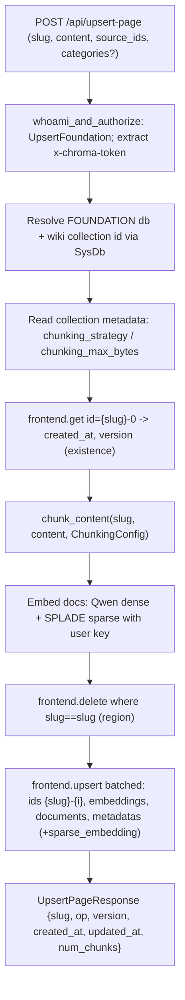
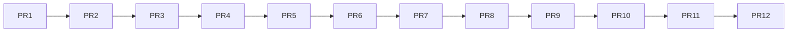

# Add `/upsert-page` to foundation-api

## Goal

A `POST /api/upsert-page` route on `foundation-api` that, given `{ slug, content, source_ids, categories? }`, replaces a wiki page's chunks in the `FOUNDATION`/`wiki` collection: read the `{slug}-0` chunk to preserve `created_at` and bump `version`, delete all chunks where `slug == slug`, then re-chunk + re-embed + re-upsert — byte-faithfully mirroring `foundation-research`'s `WikiStore.upsert_file`/`_write`.

## Key facts established during research

- `foundation-api` is **control-plane only** today (holds only `SysDb`); it has no record I/O. See [rust/foundation-api/src/server.rs](rust/foundation-api/src/server.rs) and [rust/foundation-api/src/lib.rs](rust/foundation-api/src/lib.rs).
- There is **no server-side auto-embed** in the data plane: `upsert` requires `embeddings`, and compaction rejects log records without an embedding (`LogMaterializerError::EmbeddingMaterialization` in [rust/segment/src/types.rs](rust/segment/src/types.rs)). So we must precompute vectors.
- Per your decision: foundation-api calls the **Chroma Cloud embed service** (`chroma-cloud-qwen` dense + `chroma-cloud-splade` sparse) in [rust/chroma/src/embed/chroma_cloud.rs](rust/chroma/src/embed/chroma_cloud.rs), forwarding the user's `x-chroma-token` so embed usage bills to them, then writes records that already contain the vectors (dense in `embeddings`, sparse in `sparse_embedding` metadata).
- Sparse is a first-class metadata value: `UpdateMetadataValue::SparseVector` in [rust/types/src/metadata.rs](rust/types/src/metadata.rs); it rides in `UpsertCollectionRecordsRequest.metadatas` (no separate field).
- The chunking algorithm (`tree-sitter-markdown`, 4096-byte greedy block packing, chunk-0 = title line) lives in [foundation-research chunking.py]; no tree-sitter dep or markdown chunker exists in the Rust workspace yet.

## Data flow

## Phase 1 — Extract the data plane into `frontend-core` (critical, mechanical)

Move the in-process record-I/O cluster from `rust/frontend` into a new `rust/frontend-core/src/data_plane/` module (no cyclic dep risk: none of the new deps depend on `chroma-frontend`).

Move (with their submodules):
- `ServiceBasedFrontend` + fan-out helpers + `Metrics` — [rust/frontend/src/impls/service_based_frontend.rs](rust/frontend/src/impls/service_based_frontend.rs)
- `to_records` — [rust/frontend/src/impls/utils.rs](rust/frontend/src/impls/utils.rs)
- `executor/` tree — [rust/frontend/src/executor/mod.rs](rust/frontend/src/executor/mod.rs)
- `CollectionsWithSegmentsProvider` — [rust/frontend/src/get_collection_with_segments_provider.rs](rust/frontend/src/get_collection_with_segments_provider.rs)
- `FrontendConfig` — [rust/frontend/src/config.rs](rust/frontend/src/config.rs)
- `ValidationError` — `rust/frontend/src/types/errors.rs`

Crate wiring:
- Add to [rust/frontend-core/Cargo.toml](rust/frontend-core/Cargo.toml): `chroma-config`, `chroma-cache`, `chroma-metering`, `chroma-segment`, `chroma-sqlite`, `chroma-system`, `chroma-memberlist`, `chroma-distance`, `backon`, `futures`, `parking_lot`, `rand`.
- In `chroma-frontend`, replace the moved code with re-exports (keep `pub type Frontend = frontend_core::data_plane::ServiceBasedFrontend;` in [rust/frontend/src/impls/mod.rs](rust/frontend/src/impls/mod.rs)); update `server.rs`, `lib.rs`, `bin` imports. `server.rs`, `quota/`, OpenAPI/Swagger, auth, scorecard stay put.
- Validate the move with `cargo build -p chroma-frontend` and the existing frontend tests — behavior must be unchanged.

Keep metering optional/callable by callers (handlers still set up `CollectionReadContext`/`CollectionWriteContext`); do not bake HTTP concerns into the moved code.

## Phase 2 — Give foundation-api a data plane + embeddings

- [rust/foundation-api/Cargo.toml](rust/foundation-api/Cargo.toml): depend on the moved data plane (via `frontend-core`) and add `chroma = { path = "../chroma", default-features = false, features = ["rustls"] }` for the cloud embedding functions, plus `chroma-metering`.
- [rust/foundation-api/src/config.rs](rust/foundation-api/src/config.rs): embed a `FrontendConfig` (data-plane subset: `sysdb`, `log`, `executor`, `collections_with_segments_provider`, knn index, etc.) and a `region` string.
- [rust/foundation-api/src/lib.rs](rust/foundation-api/src/lib.rs): construct `ServiceBasedFrontend::try_from_config(&(frontend_cfg, system), &registry)` at startup (mirror [rust/frontend/src/lib.rs](rust/frontend/src/lib.rs)).
- [rust/foundation-api/src/server.rs](rust/foundation-api/src/server.rs): add `frontend: ServiceBasedFrontend` to `FoundationApiServer`.

## Phase 3 — Port chunking to Rust

- New `rust/foundation-api/src/wiki/chunking.rs` porting [foundation-research chunking.py]: `ChunkStrategy {Lines, TreesitterMarkdown}`, `ChunkingConfig {strategy, max_bytes=4096}` with `from_collection_metadata` (fallback `lines`), `Chunk {id, slug, chunk_id, line_no, text}`, `chunk_id_for`, `split_lines`, `chunk_treesitter_markdown`, `_collect_block_units`/`_pack_blocks`/`_pack_lines` (UTF-8 byte budget), `_append_inter_chunk_separators`, `title_from_content`.
- Add `tree-sitter` + `tree-sitter-md` crates. **Risk/parity item:** confirm the Rust grammar matches Python's `tree-sitter-markdown` block boundaries; port the chunking tests from `foundation-research/tests/test_chunking*.py` to lock parity.

## Phase 4 — `/upsert-page` route + embedding helper

- New `rust/foundation-api/src/wiki/embed.rs`: build `ChromaCloudQwenEmbeddingFunction`/`ChromaCloudSpladeEmbeddingFunction` with `.api_key(user_token)`, batch of 100 via `embed_strs`; returns `Vec<Vec<f32>>` dense + `Vec<SparseVector>` sparse.
- Add `AuthzAction::UpsertFoundation` (`"foundation:upsert_foundation"`) to [rust/frontend-core/src/auth.rs](rust/frontend-core/src/auth.rs).
- New `rust/foundation-api/src/routes/upsert_page.rs` (`pub async fn foundation_upsert_page`), registered in [rust/foundation-api/src/routes/mod.rs](rust/foundation-api/src/routes/mod.rs) as `POST /api/upsert-page`:
  1. `whoami_and_authorize(.., UpsertFoundation)`; extract `x-chroma-token`; scorecard tag `op:foundation_upsert_page`.
  2. Validate: non-empty `content`, `validate_slug` (`^(?:[a-z0-9][a-z0-9-]*|category:[a-z0-9][a-z0-9-]*|)$`), `source_ids` format `<collection>:<record_id>`, category regex `^[a-z0-9][a-z0-9-]*$`; `categories = sorted(dedup)`.
  3. Resolve `FOUNDATION` db id + `wiki` collection id (and its metadata for `ChunkingConfig`) via `SysDb`.
  4. `frontend.get(ids=[{slug}-0])` → existing `created_at`/`version`; new ⇒ version=1, created_at=now; update ⇒ preserve created_at, version+=1.
  5. `chunk_content` → embed dense+sparse with user token.
  6. `frontend.delete(where {slug==slug}, region)` (only when page exists).
  7. Build per-chunk `UpdateMetadata` exactly as `_write`: `slug, chunk_id, line_no, kind (_kind_for), title, created_at, updated_at, version, sparse_embedding`; conditional `categories`, `source_ids`, `latest_raw_source_date`. `frontend.upsert` in batches of 100 (ids `{slug}-{i}`, dense in `embeddings`).
  8. Wrap reads/writes in metering contexts (mirror [rust/frontend/src/server.rs](rust/frontend/src/server.rs)); return `UpsertPageResponse`.
- Domain `UpsertPageError: ChromaError` (InvalidArgument for validation, etc.).

## Phase 5 — `latest_raw_source_date` (optional, faithful)

Port `RawSourceDateResolver` from `foundation-research/source_dates.py`: for each `source_id`, `frontend.get` the source collection record metadata, parse newest of `last_edited_time_iso/timestamp/last_edited_time/...`, store epoch seconds. Can ship as a follow-up; omit field if unresolved.

## PR stack (incremental, bottom-up)

Each PR stacks on the previous, is independently reviewable, and must build + pass existing tests on its own. PRs 1-6 are pure refactor (no behavior change in `chroma-frontend`); PRs 7-12 add the new feature. Split the risky extraction so `ServiceBasedFrontend` moves last, after all its dependencies already live in `frontend-core`.

- **PR 1 — Scaffold `frontend-core::data_plane`.** Add the new deps to [rust/frontend-core/Cargo.toml](rust/frontend-core/Cargo.toml) (`chroma-config`, `chroma-cache`, `chroma-metering`, `chroma-segment`, `chroma-sqlite`, `chroma-system`, `chroma-memberlist`, `chroma-distance`, `backon`, `futures`, `parking_lot`, `rand`) and create an empty `data_plane` module. No code moves yet. `[CHORE](frontend-core): Scaffold data_plane module + deps`
- **PR 2 — Move `ValidationError`.** Relocate `rust/frontend/src/types/errors.rs::ValidationError` into `frontend-core`; re-export from `chroma-frontend`. Small, self-contained. `[CHORE](frontend-core): Move ValidationError`
- **PR 3 — Move `CollectionsWithSegmentsProvider`.** Relocate [rust/frontend/src/get_collection_with_segments_provider.rs](rust/frontend/src/get_collection_with_segments_provider.rs) (deps: sysdb/cache/types already available); re-export. `[CHORE](frontend-core): Move collections-with-segments provider`
- **PR 4 — Move `executor/` tree.** Relocate [rust/frontend/src/executor/mod.rs](rust/frontend/src/executor/mod.rs) (Local + Distributed); re-export. `[CHORE](frontend-core): Move query executor`
- **PR 5 — Move `FrontendConfig` + `to_records`.** Relocate [rust/frontend/src/config.rs](rust/frontend/src/config.rs) data-plane config and [rust/frontend/src/impls/utils.rs](rust/frontend/src/impls/utils.rs); keep `FrontendServerConfig` in `chroma-frontend` referencing the moved type. `[CHORE](frontend-core): Move FrontendConfig + record utils`
- **PR 6 — Move `ServiceBasedFrontend`.** Relocate [rust/frontend/src/impls/service_based_frontend.rs](rust/frontend/src/impls/service_based_frontend.rs); keep `pub type Frontend = frontend_core::data_plane::ServiceBasedFrontend;` alias and fix all `server.rs`/`lib.rs`/`bin` imports. Gate on full `chroma-frontend` test suite — this is the keystone PR. `[CHORE](frontend-core): Move ServiceBasedFrontend`
- **PR 7 — foundation-api data plane wiring.** Add deps (`chroma` for embeds, `chroma-metering`), embed `FrontendConfig` + `region` in [rust/foundation-api/src/config.rs](rust/foundation-api/src/config.rs), construct `ServiceBasedFrontend` at startup, add `frontend` field to `FoundationApiServer`. No route yet (build-only). `[ENH](foundation-api): Wire in-process data plane`
- **PR 8 — Chunking port.** Add `tree-sitter` + `tree-sitter-md`; add `wiki/chunking.rs` + ported parity tests from `foundation-research/tests/test_chunking*.py`. Pure, self-contained, no integration. `[ENH](foundation-api): Port wiki markdown chunking`
- **PR 9 — Embedding helper.** Add `wiki/embed.rs` (Qwen dense + SPLADE sparse via user `x-chroma-token`, batched 100). Unit-testable in isolation. `[ENH](foundation-api): Add cloud embedding helper`
- **PR 10 — `UpsertFoundation` authz + route skeleton.** Add `AuthzAction::UpsertFoundation` to [rust/frontend-core/src/auth.rs](rust/frontend-core/src/auth.rs); add `routes/upsert_page.rs` request/response structs + auth + validation (slug/categories/source_ids) returning a stub, registered as `POST /api/upsert-page`. `[ENH](foundation-api): Add upsert-page authz + validation`
- **PR 11 — Wire the upsert-page flow.** Resolve collection + chunking config, read `{slug}-0`, delete-by-slug, re-chunk/embed, batched upsert with full metadata (incl `sparse_embedding`), metering contexts; integration tests (version/created_at preservation, delete+re-add chunk count, sparse shape). `[ENH](foundation-api): Implement upsert-page replace flow`
- **PR 12 — (optional) `latest_raw_source_date`.** Port `RawSourceDateResolver`. `[ENH](foundation-api): Resolve latest raw source date`

Notes: PRs 8 and 9 only depend on PR 7's crate wiring (not on each other) and could be reviewed in parallel, but keep them stacked linearly for a clean merge train. If PR 6 proves too large in review, it can be split again by moving read methods (`get`/`query`/`search`/`count`) separately from write methods (`add`/`upsert`/`delete`).

## Risks / notes

- Phase 1 is the largest/riskiest change (critical code). Keep it behavior-preserving and gate on frontend's existing test suite before touching foundation-api.
- Tree-sitter grammar parity between Python and Rust is the main fidelity risk — covered by porting the chunking tests.
- Two write-billing surfaces exist: embed usage (billed via forwarded `x-chroma-token`) and data-plane write metering (via `CollectionWriteContext`); wire both.
- Collection chunking strategy must be read from collection metadata (new wikis = `treesitter-markdown`, legacy = `lines`) so edits match how the page was originally written.
