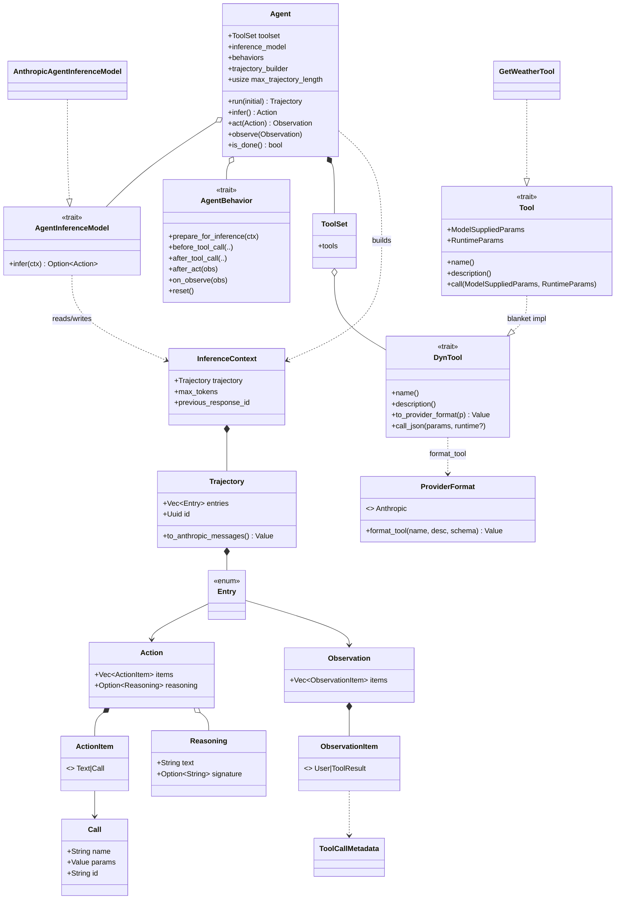
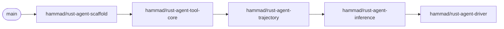

# Port the search-agent framework to `rust/agent`

## Scope (confirmed)
- Provider-agnostic core: `Agent` state machine, `Trajectory`/`Action`/`Observation` + builders, `ToolSet`/`Tool` abstraction, `ProviderFormat` tool serialization, and the trajectory -> Anthropic message converter.
- Anthropic inference model only (other providers deferred).
- A single dummy `get_weather` tool to exercise the Tool abstraction and the full infer -> act -> observe loop. Concrete Chroma-backed tools are deferred.

Deferred (not in this milestone): Chroma-backed tools (`search_corpus`, `grep_corpus`, `read_document`, `prune_chunks`) + OpenAI embeddings, OpenAI/Moonshot/Tinker/Modal-Harmony inference, rerankers (`rerank.py`), eval/dataset/metrics (`tasks.py`, `datagen/search_dataset.py`), the dedup/pruning agents, and `TokenBudgetRetrievalSubagent`.

## New crate layout
Add `rust/agent` as a workspace member in `[Cargo.toml](Cargo.toml)` (members list + a `chroma-agent = { path = "rust/agent" }` workspace dep). Async throughout via `tokio`; tool fan-out via `futures::future::join_all` instead of Python's `ThreadPoolExecutor`. No dependency on `rust/chroma` in this milestone.

```
rust/agent/
  Cargo.toml          # deps: tokio, reqwest, serde, serde_json, schemars, async-trait, thiserror, tracing, uuid, futures, indexmap
  src/
    lib.rs            # re-exports
    provider.rs       # ProviderFormat enum (single Anthropic variant for now)
    tool.rs           # Tool trait (typed, what you write) + blanket DynTool impl (internal), ToolCallMetadata, ToolSet
    tools/
      weather.rs      # dummy GetWeatherTool: impl Tool with ModelSuppliedParams = WeatherParams { location }
    trajectory.rs     # Action/Observation/Trajectory (name+text enums) + builders + to_anthropic_messages
    inference.rs      # AgentInferenceModel trait + AnthropicAgentInferenceModel
    agent.rs          # base Agent driver + AgentBehavior hook trait
    error.rs          # AgentError (thiserror): InvalidJson, UnknownTool, ToolRuntimeParamsTypeMismatch, Http, Unsupported, ...
```

## Key types and relationships

### Core type definitions
```rust
// provider.rs
// Single variant for now; the dispatch seam stays so new providers slot in later.
pub enum ProviderFormat { Anthropic }

// provider.rs — tool serialization written ONCE; every tool + every provider
// format benefits for free. No intermediate `ToolSchema` struct: the only
// provider-agnostic inputs are name, description, and the params JSON schema
// (a `Value` generated from `Tool::ModelSuppliedParams` via schemars), so the
// provider formats those directly.
impl ProviderFormat {
    pub fn format_tool(self, name: &str, description: &str, params_schema: Value) -> Value;
    // Anthropic => { name, description, input_schema: params_schema }
}

// tool.rs
pub enum ToolCallMetadata { /* extension point; empty in this milestone */ }

// THE trait you implement to define a tool. The params schema is derived from
// `ModelSuppliedParams`; you never write a schema or any provider conversion.
// `ModelSuppliedParams` come from the model; `RuntimeParams` are harness/externally-supplied
// (Python's `overrides`, e.g. ignore_ids/query/max_tokens).
#[async_trait]
pub trait Tool: Send + Sync + 'static {
    type ModelSuppliedParams: DeserializeOwned + JsonSchema + Send;
    type RuntimeParams: Default + Send + Sync + 'static;   // e.g. () when nothing is injected
    fn name(&self) -> &str;
    fn description(&self) -> &str;
    async fn call(&self, params: Self::ModelSuppliedParams, runtime: Self::RuntimeParams)
        -> Result<(String, Option<ToolCallMetadata>), AgentError>;
}

// Object-safe form held by ToolSet. Provided automatically by a blanket impl for
// every `T: Tool` — there is NO wrapper struct and you never implement this.
// `runtime` crosses the dyn boundary as `Any` and is downcast to `T::RuntimeParams`
// (the caller resolved the tool by name, so it knows the concrete type); `None` -> Default.
#[async_trait]
pub trait DynTool: Send + Sync {
    fn name(&self) -> &str;
    fn description(&self) -> &str;
    fn to_provider_format(&self, provider: ProviderFormat) -> Value; // params schema gen + ProviderFormat::format_tool
    async fn call_json(&self, params: Value, runtime: Option<Box<dyn Any + Send>>)
        -> Result<(String, Option<ToolCallMetadata>), AgentError>;
}
#[async_trait]
impl<T: Tool> DynTool for T {
    fn name(&self) -> &str { Tool::name(self) }
    fn to_provider_format(&self, provider: ProviderFormat) -> Value {
        provider.format_tool(Tool::name(self), Tool::description(self), schema_for::<T::ModelSuppliedParams>())
    }
    async fn call_json(&self, params: Value, runtime: Option<Box<dyn Any + Send>>) -> Result<_, AgentError> {
        let p: T::ModelSuppliedParams = serde_json::from_value(params)?;
        let r: T::RuntimeParams = match runtime {
            Some(b) => *b.downcast().map_err(|_| AgentError::ToolRuntimeParamsTypeMismatch { tool: self.name().into() })?,
            None => T::RuntimeParams::default(),
        };
        self.call(p, r).await
    }
}

pub struct ToolSet { tools: IndexMap<String, Arc<dyn DynTool>> } // ordered for stable provider payloads + O(1) lookup
impl ToolSet {
    pub fn add<T: Tool>(&mut self, tool: T);                  // Arc::new(tool) as Arc<dyn DynTool>
    pub fn get(&self, name: &str) -> Option<Arc<dyn DynTool>>;
    pub fn get_formats(&self, provider: ProviderFormat) -> Vec<Value>; // schema() -> to_provider_format on demand
}

// trajectory.rs
// The trajectory records tool *names* + text only (tools live in the ToolSet).
// No Arc<dyn ...> here, no UserTextTool, no custom serde -> plain derive(Serialize, Deserialize).
pub struct Call { pub name: String, pub params: Value, pub id: String }
pub enum ActionItem { Text(String), Call(Call) }     // Text = agent message to user
pub struct Reasoning {
    pub text: String,
    pub signature: Option<String>, // provider round-trip data (e.g. Anthropic thinking signature); None elsewhere
}
pub struct Action {
    pub items: Vec<ActionItem>,
    pub reasoning: Option<Reasoning>, // signature lives inside, only when reasoning exists
}
pub enum ObservationItem {
    User(String),                                    // e.g. the initial prompt
    ToolResult { call_id: String, text: String, metadata: Option<ToolCallMetadata> },
}
pub struct Observation { pub items: Vec<ObservationItem> }
pub enum Entry { Action(Action), Observation(Observation) }
pub struct Trajectory { pub entries: Vec<Entry>, pub id: Uuid }

// inference.rs
pub struct InferenceContext<'a> {
    pub trajectory: Trajectory,
    pub toolset: &'a ToolSet,
    pub max_tokens: Option<u32>,
    pub previous_response_id: Option<String>,
    pub skip_response_id_update: bool,
}
#[async_trait]
pub trait AgentInferenceModel: Send + Sync {
    async fn infer(&self, ctx: &mut InferenceContext<'_>) -> Result<Option<Action>, AgentError>;
}
```

### Type relationship diagram


### Run loop (with behavior hooks)
```mermaid
flowchart TD
    start([run initial_observation]) --> reset["reset(): clear trajectory + behaviors"]
    reset --> obs0["observe(initial): on_observe hooks then append"]
    obs0 --> done{"is_done?<br/>last Action is text-only"}
    done -->|yes| out([return Trajectory])
    done -->|no| prep["prepare_for_inference():<br/>clone trajectory into InferenceContext<br/>then run each behavior.prepare_for_inference"]
    prep --> inf["inference_model.infer(ctx)<br/>(Anthropic Messages API)"]
    inf --> act["act(action): append Action to trajectory"]
    act --> hastools{"any ActionItem::Call?"}
    hastools -->|no| done
    hastools -->|yes| call["for each Call (join_all):<br/>lookup in ToolSet by name<br/>before_tool_call -> call_json(params, None) -> after_tool_call"]
    call --> build["assemble Observation;<br/>run after_act hooks"]
    build --> obs1["observe(obs): on_observe hooks then append"]
    obs1 --> done
```

## Key design translations (Python -> Rust)
- `Tool` ABC -> a typed `#[async_trait] trait Tool` with an associated `ModelSuppliedParams: DeserializeOwned + JsonSchema` that you implement (params type + name + description + `call`). A blanket `impl<T: Tool> DynTool for T` (no wrapper struct) gives the object-safe `DynTool` stored as `Arc<dyn DynTool>` in the `ToolSet`; its `to_provider_format` generates the params schema from `ModelSuppliedParams` via `schemars` and `call_json` deserializes `Value -> ModelSuppliedParams`. You write the tool once; the schema and all provider formats come for free, and you never implement `DynTool` or write a schema.
- `ToolSchema.parameters`/`required` (two fields) -> dropped entirely. The params schema is a single `Value` generated by `schemars` (required-ness comes from `Option<T>` field optionality) and passed straight to the provider; there is no stored `ToolSchema` wrapper since it would just hold a `Value` that gets reformatted anyway.
- `ProviderFormat` enum -> kept, but with only the `Anthropic` variant for now. It owns the single-place tool serialization (`format_tool`) and (later) trajectory message conversion, so additional providers slot in without API churn.
- `ToolCallMetadata` pydantic subclassing -> a simple `ToolCallMetadata` type/enum (empty for now; the weather tool returns `None`). Kept as an extension point for future tool metadata.
- Python's always-present `reasoning` + `reasoning_signature` fields on `Action` -> a single `reasoning: Option<Reasoning>` where `Reasoning { text, signature: Option<String> }`. The Anthropic-specific signature is nested inside the (optional) reasoning block where it semantically belongs, instead of being a stray sibling field on every action.
- Python's `overrides` dict (runtime side-channel: `ignore_ids`/`query`/`max_tokens`) -> a second, per-tool typed associated type `Tool::RuntimeParams` (model-supplied `ModelSuppliedParams` vs harness-supplied `RuntimeParams`). `call(params, runtime)`. Across the object-safe `DynTool` boundary, the runtime params travel as `Option<Box<dyn Any + Send>>` and are downcast to `T::RuntimeParams` in the blanket impl (the agent resolved the tool by name, so the injector knows the concrete type); `None` falls back to `RuntimeParams::default()`. A type mismatch is a typed `AgentError::ToolRuntimeParamsTypeMismatch`, not a panic. This milestone: the weather tool sets `type RuntimeParams = ()` and the driver passes `None` (no behaviors yet); the wiring for behaviors to *produce* a `RuntimeParams` box is finalized with dedup/budget.
- Trajectory decoupled from tools: instead of Python's parallel arrays of `Tool` objects, the trajectory records names/text only via enums — `Action { items: Vec<ActionItem> }` where `ActionItem` is `Text(String)` (agent message; replaces `UserTextTool`) or `Call { name, params, id }`, and `Observation { items: Vec<ObservationItem> }` where `ObservationItem` is `User(String)` or `ToolResult { call_id, text, metadata }`. Tool schemas are sent once in the request's `tools` array (from the `ToolSet`), so a per-call tool object is unnecessary. This removes `Arc<dyn ...>` from the trajectory, the `SerializedTool`/hydration machinery, and `UserTextTool`.
- Serialization: the trajectory is plain `#[derive(Serialize, Deserialize)]` (no tool objects to erase), so no custom serde is needed.
- `to_provider_format(ANTHROPIC)` -> `to_anthropic_messages()` producing `serde_json::Value` matching the structure in `[trajectory.py](.../trajectory.py)` (`thinking`/`text`/`tool_use` assistant blocks, `text`/`tool_result` user blocks). Other format methods stubbed with an `Unsupported` error for now.

## Dummy weather tool
`GetWeatherTool` in `tools/weather.rs` implements `Tool` with `type ModelSuppliedParams = WeatherParams { location: String }` (derives `Deserialize` + `JsonSchema`; `location` non-`Option` so it's required), `type RuntimeParams = ()`, `name() = "get_weather"`, and `call(params, ())` returning a canned string (e.g. `"It is 72F and sunny in {location}."`) with `None` metadata. Registered via `toolset.add(GetWeatherTool)` — the schema is generated from `WeatherParams` automatically. This verifies schemars schema generation -> centralized Anthropic tool-format conversion, model-issued `tool_use`, typed deserialization, execution, and observation round-trip. No hand-written schema anywhere.

## Anthropic inference model
`AnthropicAgentInferenceModel` calls the Anthropic Messages API via `reqwest` (model default `claude-opus-4-5`, `thinking` enabled, interleaved-thinking beta header). Parse response content blocks into an `Action` via an `ActionBuilder`: `thinking` -> `Reasoning { text, signature }`, `text` -> `ActionItem::Text`, `tool_use` -> `ActionItem::Call { name, params, id }` (name validated against `ToolSet`). Mirrors `agent.py` lines 231-317 (non-streaming to start; streaming can be added later). API key from `ANTHROPIC_API_KEY`.

## Agent state machine + behavior composition

### Driving modes
The `Agent` is a state machine exposing the same two driving modes as the Python class:
- Manual driving (for RL / external control): the caller runs the loop themselves via `reset()`, `observe(obs)`, `infer() -> Option<Action>`, `act(action) -> Option<Observation>`, checking `is_done()`. This lets an outer system inspect/modify state between steps.
- Automatic driving: `Agent::run(initial_observation) -> Trajectory` is the built-in runner (Python's `__call__`). It calls `reset` + `observe(initial)`, then loops `infer -> act -> observe` until `is_done()` or `infer` yields no action, returning the final `Trajectory`. This is what "runs the agent" in the dummy weather end-to-end test.

So nothing external is required to run it: `run` is the default driver; manual mode is opt-in for callers who need step-level control.

Port the base `Agent`: `reset`/`observe`/`infer`/`act`/`is_done` + the `run` auto-driver, including parallel tool execution (`join_all` over `ActionItem::Call`s, looked up in the `ToolSet` by name) and terminal detection (action whose items are all `ActionItem::Text`). `InferenceContext` carries trajectory + toolset (+ `previous_response_id` placeholder for parity).

The concrete dedup/pruning subclasses are NOT ported, but we DO port the composition mechanism that replaces Python's subclass + `super()` chaining. Decision: composable behavior hooks (middleware), not trait-inheritance, because Rust trait default methods have no `super`, so layering dedup + budget would otherwise require hand-merged structs or duplicated bodies.

```rust
#[async_trait]
pub trait AgentBehavior: Send + Sync {
    fn reset(&mut self) {}
    fn prepare_for_inference(&mut self, ctx: &mut InferenceContext) {}
    fn before_tool_call(&mut self, call: &Call) {} // later: returns Option<Box<dyn Any + Send>> to inject Tool::RuntimeParams
    fn after_tool_call(&mut self, call: &Call, output: &str, meta: &Option<ToolCallMetadata>) {}
    fn after_act(&mut self, obs: &mut Observation) {}
    fn on_observe(&mut self, obs: &mut Observation) {}
}
```

`Agent` owns `behaviors: Vec<Box<dyn AgentBehavior>>`; the driver invokes each hook in registration order (reproducing the `super()` chain: e.g. dedup `after_act` then budget `after_act`). Each behavior holds its own state. For this milestone the vec is empty (dummy weather run needs no behaviors); future dedup/budget behaviors slot in with no driver changes.

### Trajectory as source of truth + masked inference views
The `Agent`'s stored `Trajectory` is always the complete, un-pruned history — it is never destructively mutated by pruning. `prepare_for_inference` instead *clones* the full trajectory and applies a masked-out view (e.g. removing chunks referenced by earlier `prune_chunks` tool calls) to produce the `InferenceContext.trajectory` that is sent to the model. The original full trajectory is what gets returned/persisted at the end. This mirrors Python's `prune_chunks_from_trajectory`, which clones and masks rather than editing in place, so the same chunk can be re-derived later and nothing is lost from the record.

Hook tradeoff noted: hooks take `&mut` over the `InferenceContext` (the clone) and `Observation` rather than returning new objects; behaviors that mask the trajectory operate on the cloned context, leaving the stored trajectory intact.

## Development PR stack

Ship as a stack of 5 small, individually reviewable PRs. Each branch is cut from the previous one (not `main`), so reviews stay focused and rebases are linear. Every PR must build (`cargo build -p chroma-agent`) and pass `cargo clippy -p chroma-agent` clean before stacking the next.



### PR 1 - `hammad/rust-agent-scaffold`
- Scope (todos: `scaffold`, `provider-schema` partial): create the `rust/agent` crate, wire it into `[Cargo.toml](Cargo.toml)` (members list + `chroma-agent` workspace dep), add deps, and land `provider.rs` (`ProviderFormat::Anthropic`) and `error.rs` (`AgentError` skeleton).
- Testable milestone: `cargo build -p chroma-agent` succeeds from the workspace; a trivial unit test constructs `ProviderFormat::Anthropic` and asserts an `AgentError` variant `Display`s. CI sees the new crate compile.

### PR 2 - `hammad/rust-agent-tool-core`
- Scope (todos: `provider-schema` remainder, `tool-core`, `weather-tool`): `provider.rs` (`ProviderFormat::format_tool`), `tool.rs` (typed `Tool` trait, blanket `impl<T: Tool> DynTool`, `ToolCallMetadata`, `ToolSet`), and `tools/weather.rs` (`GetWeatherTool`).
- Testable milestone (no network): unit tests assert (a) `ToolSet::add(GetWeatherTool)` then `get_formats(Anthropic)` yields the expected `{name, description, input_schema}` JSON with `location` required; (b) `call_json(json!({"location":"Paris"}), None)` returns the canned string and injecting a `TemperatureUnit::Celsius` runtime param switches the unit; (c) a wrong-typed runtime-params box surfaces `ToolRuntimeParamsTypeMismatch` rather than panicking.

### PR 3 - `hammad/rust-agent-trajectory`
- Scope (todo: `trajectory`): `trajectory.rs` types (`Action`/`Observation`/`Trajectory`/`Entry`/`Call`/`Reasoning`), builders, and `to_anthropic_messages()`.
- Testable milestone (no network): serde round-trip test (`Trajectory` -> JSON -> `Trajectory` equality); `to_anthropic_messages()` shape test asserting `thinking`/`text`/`tool_use` assistant blocks and `text`/`tool_result` user blocks match the Python reference structure.

### PR 4 - `hammad/rust-agent-inference`
- Scope (todo: `inference`): `inference.rs` (`InferenceContext`, `AgentInferenceModel` trait, `AnthropicAgentInferenceModel` via `reqwest`).
- Testable milestone: unit test feeds a canned Anthropic Messages response body (fixture JSON) through the content-block -> `Action` parser and asserts `thinking`->`Reasoning`, `text`->`ActionItem::Text`, `tool_use`->`ActionItem::Call`. A live single-shot inference test is gated behind `ANTHROPIC_API_KEY` / `#[ignore]`.

### PR 5 - `hammad/rust-agent-driver`
- Scope (todos: `agent`, `validate`): `agent.rs` (base `Agent` driver `reset`/`observe`/`infer`/`act`/`is_done`/`run`, `AgentBehavior` hook trait, empty behaviors vec) plus `lib.rs` re-exports.
- Testable milestone: offline end-to-end test using a `StubInferenceModel` (test-only) that scripts one `get_weather` call then a text-only terminal action — asserts the loop runs infer -> act -> observe, executes the tool, and `is_done()` terminates with the expected final `Trajectory`. The full live "What's the weather in Paris?" loop is gated behind `ANTHROPIC_API_KEY` / `#[ignore]`.

Notes:
- The `StubInferenceModel` introduced in PR 5 (or earlier, behind `#[cfg(test)]`) is what makes the driver testable without network access; it implements `AgentInferenceModel` and returns pre-scripted `Action`s.
- If reviewers prefer fewer PRs, PR 2 and PR 3 can be merged (tools + trajectory are independent), but the order above keeps each diff small and each milestone independently green.

## Validation
- `cargo build -p chroma-agent` and `cargo clippy`.
- Unit tests (no network): trajectory builders, `to_anthropic_messages` JSON shape, `ToolSet` registration, and `GetWeatherTool` output.
- End-to-end Anthropic loop test ("What's the weather in Paris?") gated behind `ANTHROPIC_API_KEY` / `#[ignore]`, consistent with `rust/chroma` test conventions.

## Open follow-ups to flag (not done here)
- Chroma-backed tools (`search`/`grep`/`read`/`prune`) + OpenAI embeddings against the native `rust/chroma` client.
- Dedup/pruning and token-budget behaviors (implemented as `AgentBehavior` impls) + Harmony token counting, plus wiring `before_tool_call` to produce a `Box<dyn Any>` `Tool::RuntimeParams` (e.g. `ignore_ids`/`query`/`max_tokens`) that the driver passes into `call_json`.
- Rerankers, eval/metrics, dataset loaders, and remaining inference providers.
