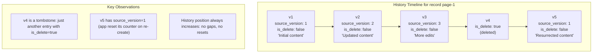
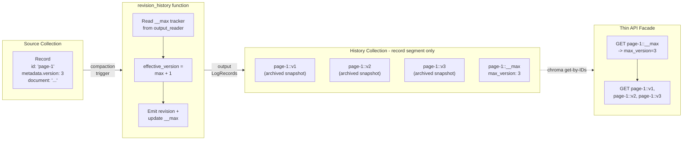

# Revision History Function

## Overview

We are building a new built-in Chroma function called `revision_history` that automatically archives every version of a record into a separate, lightweight collection. When a user writes to their source collection -- whether adding, updating, or deleting a record -- this function captures a snapshot of that record at that point in time and stores it in a history collection.

The history collection is intentionally minimal: no vector indexes, no metadata indexes, just a raw record segment. This keeps storage costs low and avoids all index maintenance overhead since we only ever append new versions (never update or delete old ones).

Each record in the history collection has a deterministic, predictable ID based on the original record ID and its version number. This means you don't need search or filtering to browse history -- you can paginate through any record's full revision timeline using simple get-by-ID calls. A thin client-side facade over Chroma's existing API is all that's needed to power a revision history UI.

The function also handles edge cases like record resurrection (delete followed by re-creation of the same ID) by maintaining a per-record version counter that never resets, ensuring the version timeline remains monotonic and gapless regardless of what the source application does.

## Design Goals

- **Version archival**: every write to the source collection produces an immutable snapshot in the history collection, enabling full audit trails and point-in-time reconstruction.
- **Lightweight storage**: the history collection is a pure record segment with all indexes disabled. Since versions only grow (append-only), the record segment is cheap to maintain -- no rebalancing, no index rebuilds, no tombstone compaction overhead.
- **Monotonic and gapless versioning**: the function enforces a strictly increasing, gap-free version sequence per record ID, even across delete/re-creation cycles.
- **Simple pagination via thin API facade**: a client can retrieve the full revision history for any record by reading its `__max` tracker and then fetching `v1..vN` by predictable composite IDs. This requires only a thin facade over Chroma's existing get-by-IDs API -- no new endpoints needed.
- **Delete awareness**: deletions produce explicit tombstone records in the history, preserving the complete lifecycle.

## How Version Histories Work

A version history is a linear timeline of snapshots for a single record. Every mutation (create, update, delete) becomes an immutable entry in this timeline. The two key properties are:

1. **Two version sequences exist in parallel**: the source application tracks its own version number in metadata (the `source_version`), while the history function maintains an independent, strictly monotonic counter (the `effective_version` / history position). These normally align but can diverge on resurrection.

2. **The history timeline is the source of truth for ordering**: regardless of what the source application does with its version numbers, the history timeline is always gapless and always increases. This is what makes pagination trivial.



The `__max` tracker for `page-1` would show `max_version: 5`. A client paginating `v1..v5` gets the complete lifecycle including the deletion and resurrection, in order, without any special logic.

## Architecture



## Input Collection (partial schema -- what the function requires)

```
Record in source collection:
  id:       String (any user-chosen ID)
  metadata:
    - {version_key}: Int (monotonically increasing per-ID, configured via params)
    - (any other user metadata)
  document: String (optional)
  embedding: Vec<f32> (not read by this function)
```

The function only reads `id`, `metadata`, and `document` from the source. Embeddings are ignored.

## Design

**Sync function** (runs inline during compaction, not via work queue).

The function watches the source collection for writes. On each invocation:

1. For **adds/upserts**: read the version identifier from record metadata (key name configurable via `params`), resolve the effective version via the `__max` tracker (see Resurrection Handling below), then write to the output collection with a composite ID `"{original_id}::v{effective_version}"`.
2. For **deletes**: increment the version (just like an add/upsert) and write a record at `"{original_id}::v{effective_version}"` with `is_delete: true` in metadata. Tombstones are simply the next version in the sequence.
3. For **each record processed**: update the `"{original_id}::__max"` tracking record with the new max version.

The output collection uses a schema with **all indexes disabled** (no vector/KNN, no metadata inverted indexes) -- purely a record segment for lightweight archival storage. Since versions only grow and records are never updated or removed, the record segment stays compact with zero maintenance overhead.

Versions are monotonically increasing and gapless within the history collection. The function itself enforces this invariant even across deletion/re-creation cycles.

### Resurrection Handling

When a record is deleted and re-created, the source application may reset the version counter (e.g. back to 1). The function handles this via a per-ID tracking record:

- **Tracking record ID**: `"{original_id}::__max"` with metadata `{ max_version: Int }`
- On processing a write, the function reads `__max` from output_reader
- If incoming source_version <= max_version (collision), effective_version = max_version + 1
- Otherwise, effective_version = max_version + 1 (always increment from tracked max, regardless of source version)
- The original source version is preserved in metadata as `source_version`

**Pagination** (client-side): read `"{id}::__max"` to get `max_version`, then fetch `"{id}::v1"` through `"{id}::v{max_version}"`. Tombstones are just regular versions with `is_delete: true` -- no separate lookup needed.

## Data Model (output collection records)

**Revision record** (for adds/upserts AND deletes -- unified format):
```
ID:       "{original_id}::v{effective_version}"
Document: original document content (None for deletes)
Metadata:
  - original_id: String
  - version: Int (effective_version in the history timeline)
  - source_version: Int (version from source metadata; absent for deletes)
  - archived_at: Int (unix millis)
  - is_delete: Bool (true for deletions, false for snapshots)
  - (all original metadata preserved for snapshots)
```

Tombstones use the exact same ID scheme and just occupy the next version slot. This keeps the timeline fully linear -- paginating `v1..vN` gives you the complete history including deletions, with `is_delete` distinguishing snapshots from tombstones.

**Tracking record** (per original_id):
```
ID:       "{original_id}::__max"
Document: None
Metadata:
  - max_version: Int
  - original_id: String
```

## Files to Change

### 1. Go constants + migration

- [go/pkg/sysdb/metastore/db/dbmodel/constants.go](go/pkg/sysdb/metastore/db/dbmodel/constants.go) -- add `FunctionRevisionHistory` UUID and `FunctionNameRevisionHistory = "revision_history"`, plus add to `functionIDToName` map.
- New migration file `go/pkg/sysdb/metastore/db/migrations/20260525150000.sql` -- INSERT the new function row into the `functions` table with `is_async = false`.

### 2. Rust executor implementation

- New file: `rust/worker/src/execution/functions/revision_history.rs` -- implements `AttachedFunctionExecutor`. Reads `version_key` from `AttachedFunction.params` (defaults to `"version"`). Iterates input records, extracts version from metadata, emits output `LogRecord` entries with composite IDs and enriched metadata. Handles deletes as tombstones.
- [rust/worker/src/execution/functions/mod.rs](rust/worker/src/execution/functions/mod.rs) -- add `pub mod revision_history;` and re-export `RevisionHistoryExecutor`.

### 3. Registration / dispatch

- [rust/worker/src/execution/operators/execute_task.rs](rust/worker/src/execution/operators/execute_task.rs) -- add `FUNCTION_REVISION_HISTORY_ID` to the imports and a new match arm in `from_attached_function()` that constructs `RevisionHistoryExecutor`.

### 4. API layer (name resolution)

- [rust/types/src/api_types.rs](rust/types/src/api_types.rs) -- add the new function ID/name to the `from_attached_function` match for API responses.
- [rust/frontend/src/impls/service_based_frontend.rs](rust/frontend/src/impls/service_based_frontend.rs) -- add the new function to the `expected_functions` validation map.

### 5. Python SDK enum

- [chromadb/api/functions.py](chromadb/api/functions.py) -- add `REVISION_HISTORY = "revision_history"` to the `Function` enum and a `REVISION_HISTORY_FUNCTION` convenience alias.

### 6. Codegen (automatic)

The Rust constants (`FUNCTION_REVISION_HISTORY_ID`, `FUNCTION_REVISION_HISTORY_NAME`) are auto-generated from the Go file by `rust/types/operator_codegen.rs` / `build.rs`. No manual Rust constant file edits needed.

## Executor Logic (pseudocode)

```rust
impl AttachedFunctionExecutor for RevisionHistoryExecutor {
    async fn execute(input_records, output_reader) -> Chunk<LogRecord> {
        let version_key = self.version_key; // from params, default "version"
        let mut output = Vec::new();
        let now = unix_millis_now();

        // Load existing max versions from output_reader for all IDs we'll process
        let mut max_versions: HashMap<String, i64> = HashMap::new();
        for record in &input_records {
            let id = record.get_user_id();
            if !max_versions.contains_key(id) {
                let max = read_max_version(output_reader, id); // reads "{id}::__max"
                max_versions.insert(id.to_string(), max.unwrap_or(0));
            }
        }

        for record in input_records {
            let original_id = record.get_user_id();
            let current_max = max_versions.get(original_id).copied().unwrap_or(0);

            let effective_version = current_max + 1;
            max_versions.insert(original_id.to_string(), effective_version);
            let id = format!("{original_id}::v{effective_version}");

            if record.is_delete() {
                output.push(LogRecord {
                    operation: Upsert, id,
                    metadata: { original_id, version: effective_version, archived_at: now, is_delete: true },
                    document: None, embedding: None,
                });
            } else {
                let source_version = record.merged_metadata().get(version_key).as_int();
                output.push(LogRecord {
                    operation: Upsert, id,
                    metadata: {
                        original_id, version: effective_version,
                        source_version, archived_at: now, is_delete: false,
                        ...original_metadata
                    },
                    document: record.document(), embedding: None,
                });
            }
        }

        // Emit __max tracker updates for all modified IDs
        for (original_id, max_ver) in &max_versions {
            output.push(LogRecord {
                operation: Upsert,
                id: format!("{original_id}::__max"),
                metadata: { max_version: max_ver, original_id },
                document: None, embedding: None,
            });
        }

        Chunk::new(output)
    }
}
```

## Output Collection Schema

The output collection should have **all indexes disabled** -- no vector/KNN index, no metadata inverted indexes, no FTS. This makes it a pure record segment (lightweight archival storage).

For now, this is the **application's responsibility** to configure at attachment time. The function itself does not enforce or create the output collection schema. The caller should pass an appropriate schema when attaching the function (or configure the output collection manually before attachment). A built-in `Schema::new_record_only()` helper may be added later as a convenience, but is out of scope for the initial implementation.

## Back-of-Envelope Estimates

Reference workload: 1M records with high revision frequency (content management, wiki-like usage).

### Storage (history collection)

| Metric | Value |
|--------|-------|
| Source records | 1M pages |
| Avg revisions/page | 150 |
| Total revision records | 150M + 1M __max trackers = 151M |
| Per revision: document | ~2KB avg |
| Per revision: metadata | ~300B (original metadata + revision fields) |
| Per revision: ID overhead | ~50B |
| **Total history size** | **~354GB** |

At 500 revisions/page (heavily edited content):
- 500M revision records → ~1.2TB in the history collection

### Memory during compaction

The function's memory profile is predictable: **records in ~ records out** (plus one __max tracker per unique ID in the batch).

| Metric | Value |
|--------|-------|
| Compaction batch size | 1000 records (typical `max_compaction_size`) |
| Avg input record (hydrated) | ~5KB (document + metadata + record overhead) |
| Input batch in memory | 1000 x 5KB = **5MB** |
| Output records (1 per input + __max updates) | ~2000 x 2.5KB = **5MB** |
| __max point lookups from output_reader | 1000 B-tree lookups; each may load an 8MB blockfile block into memory. In the worst case (all unique IDs, cold cache), this could pull in up to 1000 distinct blocks. In practice, IDs in a batch are often clustered (same collection, recent writes), so block reuse is high. Estimate **1-10 block loads per batch** (~8-80MB) with warm cache. |
| **Peak working memory** | **~20-90MB per compaction cycle** (dominated by blockfile block cache for __max lookups) |

The function adds moderate memory pressure from blockfile reads, but no more than any other incremental function (e.g. statistics). The dominant cost in any compaction cycle remains the vector index (HNSW/SPANN) maintenance on the *source* collection.

### Throughput

Since the function is sync and runs inline with compaction:
- No network calls, no external dependencies
- Processing is O(n) over the input batch: one HashMap lookup + one output record per input
- Bottleneck is the output collection's record segment writes (B-tree inserts), not the function logic itself

## Configuration (params JSON)

```json
{
  "version_key": "version"  // metadata key to read version from; defaults to "version"
}
```

## Thin Facade for Viewing Revisions (Example)

No new Chroma API endpoints are needed. A thin client-side facade over the existing Chroma API provides full revision history access. The following is an **illustrative example** -- the actual implementation may vary based on application needs:

```python
class RevisionHistory:
    """Example facade over Chroma's get-by-IDs API.

    All methods operate on the HISTORY timeline position (effective_version),
    not the source application's version number. These two sequences can
    diverge after a resurrection (delete + re-add of the same ID), so
    translating between them always requires a lookup.

    Each returned record's metadata contains both:
      - "version": the history position (what you paginate by)
      - "source_version": the application's original version number
    """

    def __init__(self, history_collection):
        self.coll = history_collection

    def get_max_version(self, record_id: str) -> int:
        """Get the total number of history entries for a record."""
        result = self.coll.get(ids=[f"{record_id}::__max"], include=["metadatas"])
        return result["metadatas"][0]["max_version"]

    def get_at_position(self, record_id: str, position: int):
        """Fetch a single history entry by its timeline position (1-based)."""
        return self.coll.get(ids=[f"{record_id}::v{position}"], include=["metadatas", "documents"])

    def list_revisions(self, record_id: str, page: int = 1, page_size: int = 10):
        """Paginate the history timeline. Returns entries in chronological order,
        including tombstones (is_delete=true). Each entry carries source_version
        in metadata for cross-referencing with the application's version scheme."""
        max_ver = self.get_max_version(record_id)
        start = (page - 1) * page_size + 1
        end = min(start + page_size - 1, max_ver)
        ids = [f"{record_id}::v{v}" for v in range(start, end + 1)]
        return self.coll.get(ids=ids, include=["metadatas", "documents"])

    def find_by_source_version(self, record_id: str, source_version: int):
        """Find the history entry matching a specific source_version.
        Requires a scan since no metadata indexes exist on the history collection
        and we cannot know a priori whether the history and source version
        sequences have diverged (resurrection may have occurred at any point).
        For large histories, consider caching the source_version->position mapping."""
        max_ver = self.get_max_version(record_id)
        # Scan in reverse (most recent first) since source_version resets on resurrection
        for pos in range(max_ver, 0, -1):
            entry = self.get_at_position(record_id, pos)
            if entry["metadatas"][0].get("source_version") == source_version:
                return entry
        return None
```

Because history versions are gapless and IDs are deterministic, the facade needs no search/filter capabilities -- simple get-by-IDs is sufficient for pagination. Tombstones (deletes) are just another version in the sequence with `is_delete: true`, so they appear naturally without any special handling.

Note: `find_by_source_version` always requires a scan (O(n) over history length) because we cannot know whether the two version sequences have diverged without checking. The history collection has no metadata indexes, so there is no way to query by `source_version` directly. Applications that frequently need source_version lookup should cache the mapping client-side.

## Reverting to a Previous Version

Reverting a record to an older version is a client-side operation that writes back to the source collection. Since the history collection stores no embeddings (record-only), the source collection's embedding function must re-embed the reverted content.

```python
def revert_to_version(self, source_collection, record_id: str, target_version: int):
    # 1. Fetch the historical snapshot
    revision = self.get_revision(record_id, target_version)
    metadata = revision["metadatas"][0]
    document = revision["documents"][0]

    if metadata.get("is_delete"):
        raise ValueError(f"Version {target_version} is a deletion, cannot revert to it")

    # 2. Strip revision-history metadata (not part of the original record)
    internal_keys = {"original_id", "version", "source_version", "archived_at", "is_delete"}
    restored_metadata = {k: v for k, v in metadata.items() if k not in internal_keys}

    # 3. Upsert back to source -- this triggers re-embedding
    #    The source collection's embedding function will generate a new embedding
    #    from the restored document content.
    source_collection.upsert(
        ids=[record_id],
        documents=[document],
        metadatas=[restored_metadata],
        # No embedding provided -- the collection's embedding function handles this
    )
```

Key points:
- The revert is just a normal upsert to the source collection with the old document/metadata
- The source collection's configured embedding function re-embeds the document automatically
- This upsert itself triggers the revision_history function, archiving the revert as the next version in the timeline (creating a full audit trail: v5 -> revert to v2 content -> archived as v6)
- No special API needed -- it's a standard write through Chroma's existing interface

## Why Record-Only Storage is Cheap

The history collection is append-only in practice:
- Revision records are written once and never updated (immutable snapshots)
- `__max` trackers are the only records that receive updates (one per source record ID)
- No deletes ever occur in the history collection
- No vector index means no HNSW/SPANN graph maintenance (the dominant cost in typical collections)
- No metadata indexes means no inverted index rebuilds

The record segment's blockfile B-tree will still incur some rebalancing/block-splits as new IDs interleave lexicographically (e.g. `page-1::v3` lands between `page-1::v2` and `page-2::v1`). This is inherent to the blockfile design. However, without vector or metadata index maintenance, the write amplification is limited to just the B-tree layer -- orders of magnitude cheaper than a full indexed collection. Storage cost scales linearly with the number of versions archived.

**Reads are equally cheap.** Since all access is by known IDs (deterministic composite keys), every read is a direct B-tree point lookup -- O(log n) per key. There is no query planning, no filter evaluation, no ANN search, no inverted index intersection. Fetching a page of 10 revisions is just 10 point lookups against the record segment. The B-tree's lexicographic ordering also means versions for the same original_id are clustered together in adjacent blocks (`page-1::v1`, `page-1::v2`, `page-1::v3`...), giving good cache locality for sequential version reads.
